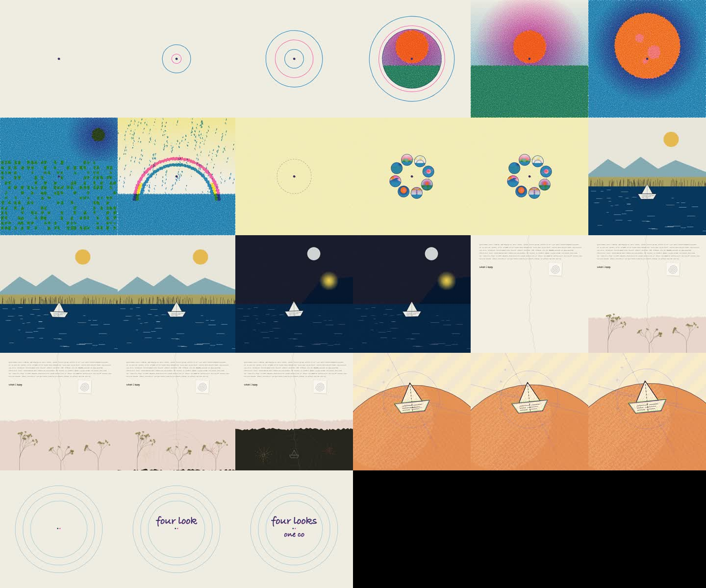

# skills

[Claude Code](https://claude.com/claude-code) skills I've made. Each one lives in `skills/<name>/` and is self-contained: a `SKILL.md` plus templates, examples and references.

| skill | what it does |
|---|---|
| [riso-rooms](skills/riso-rooms) | Isometric illustrations that look risograph-printed: cutaway rooms with halftone inks, misaligned plates and wobbly lines, drawn in code on a canvas you can pan and zoom. |
| [logo-intro](skills/logo-intro) | A kinetic name/logo intro in plain JS: atom rings, hyperspace warp, flash, letters popping in with doodles, a boiling highlight box, a wipe to a sparkle. |
| [hand-drawn-canvas-animation](skills/hand-drawn-canvas-animation) | 10–30 s films where every frame is drawn in Canvas 2D JavaScript: ink on warm paper, riso halftones, screen prints or graphite, rendered to mp4 with a generated Web Audio score. |
| [ink-abstraction](skills/ink-abstraction) | A 12-panel pen-and-ink abstraction sheet of any subject in vanilla JS: hatched sketch → black masses → cross-stitch grid → patterned cells → a few lines and one knot. |

## Install

Clone once, then link the skills you want:

```sh
git clone https://github.com/IshaanKalra2103/riso-rooms ~/src/claude-skills
ln -s ~/src/claude-skills/skills/riso-rooms ~/.claude/skills/riso-rooms
ln -s ~/src/claude-skills/skills/logo-intro ~/.claude/skills/logo-intro
ln -s ~/src/claude-skills/skills/hand-drawn-canvas-animation ~/.claude/skills/hand-drawn-canvas-animation
ln -s ~/src/claude-skills/skills/ink-abstraction ~/.claude/skills/ink-abstraction
```

Then ask Claude Code for one (e.g. "make an animated intro for my name") or run `/logo-intro`, `/riso-rooms`.

---

## riso-rooms


*`examples/listening-room.html`: records spinning, string lights twinkling, a dancer, a cat. Every mark is drawn in code.*

- `SKILL.md`: the rules for the look, the workflow (plan rooms → block out → screenshot → add clutter → animate), and guidance on scale, density and tone.
- `template/index.html`: a zero-dependency engine plus two example rooms.
- `examples/listening-room.html`: a full single-room scene (the image above).
- `references/api.md`: the drawing API (boxes, walls, windows, bookcases, lamps, plants, people in 6 poses, light, steam…).

**Controls:** drag or scroll to pan and zoom, pinch on touch, WASD to move, `0` to fit, `P` to save a PNG, double-click a room to fly to it.
**URL options:** `?room=<id>`, `&zoom=N`, `?frame=N` (freeze time), `?still` (no idle tour).

Inspired by Kevin Ngo's ["a small light, room by room"](https://a-small-light-three.vercel.app/) ([tweet](https://x.com/kevin_t_ngo/status/2100238648218427563)). The engine and scenes here are original code.

## logo-intro


- `SKILL.md`: the stage timeline, how to retime or cut stages, the rules of the look, and how to check it with frozen-frame screenshots.
- `template/index.html`: the whole animation (~350 lines of canvas JS, no libraries).

**Controls:** click or space to replay.
**URL options:** `?name=ada`, `&accent=0` (which letter gets the box), `&yellow=ff5a36&blue=00a37a` (any palette key, hex without `#`), `&speed=0.8`, `?t=9` (freeze time).

Made by rebuilding a reference motion-graphics intro frame by frame in JavaScript.

## hand-drawn-canvas-animation



- `SKILL.md`: the procedure (brief → beat sheet → palette → puppets → scenes one at a time → full render → score), 12 rules and a review checklist.
- `assets/core.js` + `assets/film-template.html`: the shared core (palettes, four finishes, marks, lattices, reveals, camera, timeline, player) and the file you copy per film.
- `examples/`: a 9.5 s fruit-fly ink film and a paper boat through all four looks.
- `scripts/render.mjs`: a frame grid in seconds, spot frames, full mp4 on twos with a contact sheet. `scripts/wav.mjs`: the score to WAV, headless.
- `references/`: style rules, palettes, 26 scene recipes, architecture and pitfalls.

Needs Node 18+, Chrome and ffmpeg. `cd` into a film folder with `core.js`, `render.mjs`, `wav.mjs` and `package.json`, `npm i`, then `node render.mjs film.html --grid 24`.

The looks are rebuilt from Kevin Ngo's films ([the life of a fruit fly](https://x.com/kevin_t_ngo/status/2099858454043349342) and others). The core and scenes are original code.

## ink-abstraction


- `SKILL.md`: how to describe a subject (silhouette polygons, a shade field, detail strokes, an anchor), the rules of the look, and how to check it with a headless screenshot.
- `assets/engine.js`: the twelve stages, paper, boil and controls, no libraries. A subject file calls `defineSheet({...})`.
- `examples/`: a grazing bull and a cartoon hot dog. `scripts/shot.sh`: screenshot a sheet with headless Chrome.

**Controls:** click for a new variation, `B` toggles the boil. **URL options:** `?still`, `?seed=N`.

## License

MIT
