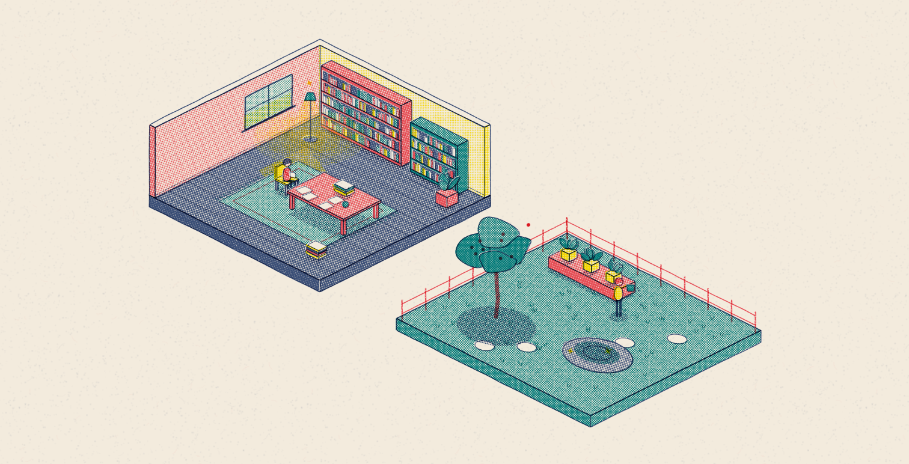

# riso-rooms

A [Claude Code](https://claude.com/claude-code) skill for making **isometric illustrations that look risograph-printed**: cutaway rooms, gardens and little worlds drawn entirely in code on one HTML canvas. It uses halftone inks that mix where they overlap, slightly misaligned color plates, wobbly hand-drawn lines and small looping animations. You can pan and zoom the scene.



## Install

```sh
git clone https://github.com/IshaanKalra2103/riso-rooms ~/.claude/skills/riso-rooms
```

Then in Claude Code, ask for an isometric riso-style scene or run `/riso-rooms`.

## What's inside

- `SKILL.md`: the rules for the look, the workflow (plan rooms → block out → screenshot → add clutter → animate), and guidance on scale, density and tone.
- `template/index.html`: a zero-dependency engine plus two example rooms. Open it in a browser (or run `python3 -m http.server`).
- `references/api.md`: the drawing API (boxes, walls, windows, bookcases, lamps, plants, people in 6 poses, light, steam…).

**Controls:** drag or scroll to pan and zoom, pinch on touch, WASD to move, `0` to fit, `P` to save a PNG, double-click a room to fly to it.

**URL options:** `?room=<id>`, `&zoom=N`, `?frame=N` (freeze time), `?still` (no idle tour).

## Use without Claude

The template is a normal HTML file. Replace everything below the `SCENE — edit below` comment with your own `room({...})` calls.

## License

MIT
