# creative-skills

[Claude Code](https://claude.com/claude-code) skills I've made. Each one lives in `skills/<name>/` and is self-contained: a `SKILL.md` plus templates, examples and references.

| skill | what it does |
|---|---|
| [riso-rooms](skills/riso-rooms) | Isometric illustrations that look risograph-printed: cutaway rooms with halftone inks, misaligned plates and wobbly lines, drawn in code on a canvas you can pan and zoom. |
| [logo-intro](skills/logo-intro) | A kinetic name/logo intro in plain JS: atom rings, hyperspace warp, flash, letters popping in with doodles, a boiling highlight box, a wipe to a sparkle. |
| [hand-drawn-canvas-animation](skills/hand-drawn-canvas-animation) | Hand-drawn short films drawn in Canvas 2D JavaScript: whole-pose character drawings, ink, pencil, riso, screen print or brush-pen doodles on photos, plus rotoscoped real motion, sand animation and a pop-up paper book, rendered to mp4 with a generated Web Audio score. |
| [ink-abstraction](skills/ink-abstraction) | A 12-panel pen-and-ink abstraction sheet of any subject in vanilla JS: hatched sketch → black masses → cross-stitch grid → patterned cells → a few lines and one knot. |
| [morph-tile-loop](skills/morph-tile-loop) | Seamless geometric loops in vanilla JS: a dot opens into layered rings, morphs into a gradient star, zooms out over an endless lattice into halftone, and dives back in. |
| [iso-sim-town](skills/iso-sim-town) | A playable late-90s isometric sim town in vanilla JS: pre-rendered-looking buildings, baked shadows, dithered 256-colour pixels, traffic, day/night, a Props window and a Windows 98 UI. |
| [dither-diorama](skills/dither-diorama) | A live isometric cutaway of any place (restaurant, laundromat, office) in three.js through a square-dot dither shader, with a walking crowd, staff, scroll steps that highlight one group at a time, and a pull-back into a city. |
| [morning-debrief](skills/morning-debrief) | A daily brief page for a project: one self-contained HTML file with a public-domain painting header, the one thing to push forward, to-dos with sources, what's waiting on other people and what changed — built from Slack, meeting notes, calendar, git and local checklists, and installable as a scheduled run. |
| [slide-craft](skills/slide-craft) | Presentations as one self-contained HTML deck: fixed 1280×720 slides, thumbnail rail, presenter mode with notes, print to PDF — plus the thinking first (audience, the one sentence, the ask) and a list of the things that make slides look generated. |
| [pixel-showcase](skills/pixel-showcase) | A gacha-style "who's that?" reveal for pixel sprites: hold to charge a silhouette through rarity colours, then it bursts into its own pixels and reassembles in colour, with a stat card, NEW/SHINY stamps, a dex and chip-tune sound. Templates for animated Gen 1 Pokémon (live from PokeAPI) and procedurally generated creatures. |
| [sketchbook-portfolio](skills/sketchbook-portfolio) | An illustrated personal portfolio in plain HTML/CSS/JS: a red sketchbook hero with boiling hand-drawn SVG, stamp borders and chalk doodles, Lenis smooth scroll, a 3D-hinged page, notes that pin mid-screen while polaroids parallax past, project cards that land on a tilting grid board, nav hover doodles and click ink bursts. |
| [xray-scroll](skills/xray-scroll) | A scroll-driven x-ray film from any 3D model: three.js renders it see-through with dark rims and a floor reflection, it assembles part by part as GSAP ScrollTrigger scrubs one timeline over Lenis smooth scroll, and it cuts through pixel-mosaic, green dot-grid, red scanline, NO SIGNAL and datamosh glitches, with green tracking boxes, decoding captions and a timecode HUD. Single merged meshes (AI sculpts, scans) are split into parts automatically. |
| [comic-cover](skills/comic-cover) | Any 3D model (Meshy/AI sculpts, OBJ, FBX, glTF, rigged characters) as an interactive comic-book cover in three.js: ink outlines, cel shading, Ben-Day halftone and hatching, a Pencils → Inks → Colors switch, a masthead the hero breaks through, city / storm-sky / action-burst backdrops, drag-to-orbit, web and beam powers, lightning, SFX lettering and a duotone sense mode. |
| [scientific-figure-making](skills/scientific-figure-making) | Publication-ready matplotlib figures for papers, slides and reports: grouped bars, trends, heatmaps and multi-panel layouts in one house style (palette, fonts, spines, legend panels, print-safe hatching, vector export). By Chen Liu, from [figures4papers](https://github.com/ChenLiu-1996/figures4papers). |
| [dither-reveal](skills/dither-reveal) | Any image as a 1-bit Floyd–Steinberg dither that the cursor peels back to colour, in one WebGL2 page. Veil mode burns a lingering hole with colour leaking into the dots at its edge; filings mode turns every dot into an iron filing that the cursor lifts like a magnet into a spiky ferrofluid blob, then lets slide home. Comes with a script that cuts any photo off its background and embeds it, and a raymarched geode whose hover lens shows its cross-section. |
| [pixel-rebuild](skills/pixel-rebuild) | Any pixel-art video, GIF or screen recording rebuilt as a crisp canvas page, pixel for pixel: it finds the art's native grid (even non-integer upscales), splits the clip into one background, deduplicated sprites and a palette, and replays the timeline in a zero-dependency player. A Chrome check compares every frame with the source and exports a GIF. |
| [postage-collage](skills/postage-collage) | Original postage-stamp series as a collage page in plain HTML/CSS: ten stamp families (old-master editorial, pixel-fragment portrait, botanical strips, giant condensed word, narrow window, Swiss-Japanese pair, street-label ticket, green duotone panels, red duotone poster, red-circle collage), real CSS perforations, grain, postmarks and tape, a click-to-inspect zoom, and public-domain image fetch and print treatment from Wikimedia Commons. |
| [motion-reel](skills/motion-reel) | Short vertical motion graphics (Reels/Shorts, 1080×1920, ~20 s, with sound) rendered entirely in code with Python + skia + ffmpeg. Two templates: a flat editorial-poster explainer with a procedural beat-grid soundtrack, and a 3D-camera piece (dive, depth of field, an orbit that exposes an animate-to-camera cheat, 24 fps on twos, motion blur, cursor auto-zoom) cut to a stock track's real drops. Comes with lessons and a style catalogue from studying 30 motion-design reels, and scripts to study reference reels and to pick music and find its drops. |
| [signal-print](skills/signal-print) | A grainy signal-orange "ops-print" identity in two sheets of 4:5 plates: rotated tape strips with tickers, a crosshair emblem, a numbered run log, barred type crossed by a ring-matrix word, a live terminal, a halftone mark with a cursor loupe, a night-shift dial and an ID badge — plus an all-SVG asset kit (icons on keylines, mark construction and lockups, a blueprint, pattern tiles, seals and rubber stamps, an animated weave diagram, dingbats, live instruments) where every asset downloads as a clean .svg. |
| [isometric-svg](skills/isometric-svg) | Animated isometric line art in plain SVG + JS: black faces, hairline white strokes, glare bands, one accent. A tiny engine for boxes, extruded profiles, wheels, tubes, rounded plates and clipping through openings, all driven by a freezable clock. Examples: a draggable filing cabinet and a seven-panel F1 pit wall (pit stop with jacks and tyre change, scanner bay, live circuit map, telemetry, wind tunnel, tyres, timing tower) on one race clock, plus a contact-sheet script. |
| [motion-replica](skills/motion-replica) | Any motion-graphics video (app ad, promo, grid reel, UI walkthrough) rebuilt shot for shot in code: a deterministic HTML page with DOM for UI and type and three.js layers for 3D props, rendered frame by frame to an MP4 that matches the original's size, fps, length and audio. Scripts measure the reference (per-cell loop periods, cuts, contact sheets, 20 fps bursts for easing), compare replica and reference side by side and on motion sheets, and render on the GPU. Includes a procedural 3D kit (foil pouch, $100 bills, basketball, watch, embossed/glass/cel-shaded coins, bevelled 3D digits, a GLB repaint loader) and a full 2×2 fintech-ad example. |

## Install

Clone once, then link the skills you want:

```sh
git clone https://github.com/IshaanKalra2103/creative-skills ~/src/claude-skills
ln -s ~/src/claude-skills/skills/riso-rooms ~/.claude/skills/riso-rooms
ln -s ~/src/claude-skills/skills/logo-intro ~/.claude/skills/logo-intro
ln -s ~/src/claude-skills/skills/hand-drawn-canvas-animation ~/.claude/skills/hand-drawn-canvas-animation
ln -s ~/src/claude-skills/skills/ink-abstraction ~/.claude/skills/ink-abstraction
ln -s ~/src/claude-skills/skills/morph-tile-loop ~/.claude/skills/morph-tile-loop
ln -s ~/src/claude-skills/skills/iso-sim-town ~/.claude/skills/iso-sim-town
ln -s ~/src/claude-skills/skills/dither-diorama ~/.claude/skills/dither-diorama
ln -s ~/src/claude-skills/skills/pixel-showcase ~/.claude/skills/pixel-showcase
ln -s ~/src/claude-skills/skills/sketchbook-portfolio ~/.claude/skills/sketchbook-portfolio
ln -s ~/src/claude-skills/skills/scientific-figure-making ~/.claude/skills/scientific-figure-making
ln -s ~/src/claude-skills/skills/dither-reveal ~/.claude/skills/dither-reveal
ln -s ~/src/claude-skills/skills/xray-scroll ~/.claude/skills/xray-scroll
ln -s ~/src/claude-skills/skills/comic-cover ~/.claude/skills/comic-cover
ln -s ~/src/claude-skills/skills/pixel-rebuild ~/.claude/skills/pixel-rebuild
ln -s ~/src/claude-skills/skills/postage-collage ~/.claude/skills/postage-collage
ln -s ~/src/claude-skills/skills/motion-reel ~/.claude/skills/motion-reel
ln -s ~/src/claude-skills/skills/signal-print ~/.claude/skills/signal-print
ln -s ~/src/claude-skills/skills/isometric-svg ~/.claude/skills/isometric-svg
ln -s ~/src/claude-skills/skills/motion-replica ~/.claude/skills/motion-replica
```

Then ask Claude Code for one (e.g. "make an animated intro for my name") or run `/logo-intro`, `/riso-rooms`.

---

## riso-rooms


*`examples/listening-room.html`: records spinning, string lights twinkling, a dancer, a cat. Every mark is drawn in code.*

- `SKILL.md`: the rules for the look, the workflow (plan rooms → block out → screenshot → add clutter → animate), and guidance on scale, density and tone.
- `template/index.html`: a zero-dependency engine plus two example rooms.
- `examples/listening-room.html`: a full single-room scene (the image above).
- `references/api.md`: the drawing API (boxes, walls, windows, bookcases, lamps, plants, people in 6 poses, light, steam…).

**Controls:** drag or scroll to pan and zoom, pinch on touch, WASD to move, `0` to fit, `P` to save a PNG, double-click a room to fly to it.
**URL options:** `?room=<id>`, `&zoom=N`, `?frame=N` (freeze time), `?still` (no idle tour).

Inspired by Kevin Ngo's ["a small light, room by room"](https://a-small-light-three.vercel.app/) ([tweet](https://x.com/kevin_t_ngo/status/2100238648218427563)). The engine and scenes here are original code.

## logo-intro


- `SKILL.md`: the stage timeline, how to retime or cut stages, the rules of the look, and how to check it with frozen-frame screenshots.
- `template/index.html`: the whole animation (~350 lines of canvas JS, no libraries).

**Controls:** click or space to replay.
**URL options:** `?name=ada`, `&accent=0` (which letter gets the box), `&yellow=ff5a36&blue=00a37a` (any palette key, hex without `#`), `&speed=0.8`, `?t=9` (freeze time).

Made by rebuilding a reference motion-graphics intro frame by frame in JavaScript.

## hand-drawn-canvas-animation


- `SKILL.md`: the procedure (brief → beat sheet → palette → key poses → scenes one at a time → full render → score), the rules and a review checklist.
- `assets/core.js` + `assets/film-template.html`: the shared core (palettes, finishes, marks, reveals, photos and doodles, camera, timeline, player) and the file you copy per film. Engines that load beside it: `roto.js` (found motion traced from video), `sand.js` (a sand bed on backlit glass), `paper3d.js` (pop-up pages in a 3D room), plus `cels.js`, `materials.js` and `studio.js`.
- `examples/`: `becoming-phoenix/`, a 60 s film that moves through five drawing styles, sand and a pop-up book; `sketchbook-bird.html`, a whole-pose pencil study; the fruit fly, four looks, museum-photo doodles and night chase; gallop, paper horse, moon book, one seed, one year, weight and material studies; and `workshop.html`, a point-and-click screen that drives the film engine.
- `scripts/`: `render.mjs` (frame grid, spot frames, mp4 on twos with the score, contact sheet), `verify.mjs`, `photo.mjs` (cut a photo out of its background) and `roto.py` (trace motion from a video).
- `references/`: style rules, palettes, redrawn animation, motion, mixed media, found motion, sand, paper3d, studio, the doodle look, architecture and pitfalls.

Needs Node 18+, Chrome and ffmpeg; the doodle look cuts photos best with `rembg` on PATH. `cd` into a film folder with `core.js`, `render.mjs` and `package.json`, `npm i`, then `node render.mjs film.html --grid 24`.

Synced from [alesha-pro/tools](https://github.com/alesha-pro/tools/tree/main/skills/hand-drawn-canvas-animation) (MIT, see the skill's `LICENSE`). The first looks are rebuilt from Kevin Ngo's films ([the life of a fruit fly](https://x.com/kevin_t_ngo/status/2099858454043349342), [doodles on photos](https://x.com/kevin_t_ngo/status/2100601972902842517) and others).

## ink-abstraction


- `SKILL.md`: how to describe a subject (silhouette polygons, a shade field, detail strokes, an anchor), the rules of the look, and how to check it with a headless screenshot.
- `assets/engine.js`: the twelve stages, paper, boil and controls, no libraries. A subject file calls `defineSheet({...})`.
- `examples/`: a grazing bull and a cartoon hot dog. `scripts/shot.sh`: screenshot a sheet with headless Chrome.

**Controls:** click for a new variation, `B` toggles the boil. **URL options:** `?still`, `?seed=N`.

## morph-tile-loop


- `SKILL.md`: how the loop works (layered superellipses, keyframed channels, log zoom, symmetric spin), the workflow for matching a reference video, and the rules of the look.
- `assets/engine.js`: timeline, zoom, square/hex lattice, shape drawing and controls, no libraries. A loop file calls `defineLoop({...})`.
- `template/index.html`: teal circle → gradient star in a navy square → halftone → back, 8 s.
- `examples/hex-bloom.html`: a riso palette on a hex lattice with six-point shapes (`assets/hex-bloom.png`).
- `scripts/shot.sh`: a contact sheet of frozen frames, or `--mp4` for a full render with headless Chrome + ffmpeg.

**Controls:** space pauses. **URL options:** `?t=3.2` (freeze time), `?speed=0.5`.

Made by rebuilding a reference motion loop frame by frame in JavaScript.

## iso-sim-town


- `SKILL.md`: the five-stage pipeline behind the pre-rendered look (native 64×32 iso, baked lighting, grain textures, low-res nearest-neighbour upscale, ordered-dither palette), the workflow for laying out a town, and the rules of the look.
- `assets/engine.js`: renderer, building painter, props, traffic, pedestrians, Props window, bulldozer, day/night, save, generated ambient music and the Win98 UI, no libraries. A town file calls `defineTowns([...])`.
- `template/index.html`: one brownstone city with taxis, pedestrians and parks.
- `examples/three-towns.html`: the city plus a snowy Christmas village and a Victorian park.
- `scripts/shot.sh`: a contact sheet of views with headless Chrome, printing console errors.

**Controls:** drag or WASD to pan, wheel or `+`/`-` to zoom, hard-hat opens Props (click to place), bulldozer removes, moon toggles night, `P` pixel size, `X` dither, `M` or `1`–`9` switch towns.
**URL options:** `#2` (open town 2), `#2n` (at night).

Made by rebuilding a reference video of an isometric town builder in JavaScript.

## dither-diorama

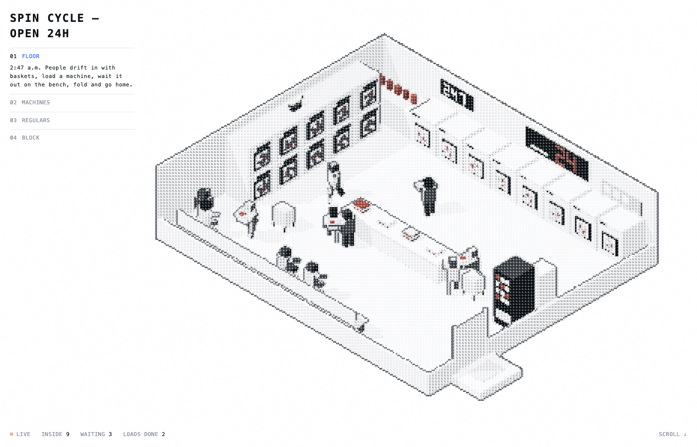

- `SKILL.md`: the five parts of the look: boxes in greys with one accent, the cell render, the soft pen, wash-not-zoom highlights and the city pull-back. Also the workflow from planning the flows to checking the stills, and the traps.
- `assets/engine.js`: `createDiorama(config)`. It covers the room shell, the build kit (grouped boxes, obstacles, seats, digits, ticks), grid A* pathfinding, and the visitor route (queue, counter with courier fetch, seat, visit). It also covers staff (post, patrol, courier), the three-pass dither render, the step UI and the generated city with traffic.
- `references/config.md`: the full config contract.
- `template/index.html`: a counter-service restaurant (Floor, Staff, Stock, City). Preview: `assets/restaurant-steps.png`.
- `examples/laundromat.html`: "Spin Cycle". Washers spin up when loaded, people read on the bench and fold, an attendant mops, a cat walks the dryers and the neon glows coral.
- `examples/pit-stop.html`: "Box, box", a Formula 1 pit stop out in the open. The car brakes in, 17 crew swap all four tyres around a live stop clock, the lollipop flips and the car launches. Includes a quarter-speed replay step.
- `scripts/shot.py`: `uv run` it to shoot every step into a contact sheet, with crowd stats and page errors.

**Scroll** moves through the steps, and clicking a step title jumps to it. **URL options:** `?step=2` (pin a step), `?speed=4`, `?t=5.2` (freeze the clock).

Made by rebuilding the "How it works" section of meuze.ai from its live behaviour, then generalising it.

## License

MIT, except skills that ship their own `LICENSE`: hand-drawn-canvas-animation (MIT, Alexey Fateev) and scientific-figure-making (CC BY-NC 4.0, Chen Liu). The morpho photo in dither-reveal's example is CC BY-SA 4.0 (Didier Descouens / MHNT).

## pixel-showcase


*Clockwise from top left: a generated legendary, the pixel burst on an epic pull, a shiny Gastly, Arcanine's card.*

- `SKILL.md`: the reveal phases, rarity rules, how to plug in your own game's sprites (GIFs or sheets), and how to verify it with screenshots.
- `template/pokemon.html`: 151 Gen 1 Pokémon with their animated Black/White sprites, shinies (1/16), types, stats and cries, fetched live from [PokeAPI](https://pokeapi.co). Nothing Pokémon is bundled in the repo.
- `template/creatures.html`: 30 seeded species (bodies, eyes, wings, horns, crowns by rarity) that blink and breathe. Works offline.

**Controls:** press and hold anywhere (or hold Space) to charge; tap the revealed sprite to poke it; the bottom pills force the next rarity; mute top right.

Inspired by my own pixel loot-card opener. Pokémon © Nintendo / Game Freak / The Pokémon Company; this is a fan toy.

## sketchbook-portfolio


- `SKILL.md`: the sections and what moves in each, the workflow (collect real facts → fill the template → draw the person's own doodles → verify), how to draw doodles that boil, the scroll tuning knobs, and gotchas.
- `template/`: the placeholder site. `styles.css` + `main.js` are the engine (identical everywhere); `index.html` holds the content, the SVG doodle library and `window.SITE`.
- `examples/ishaan/`: my own site built from it.
- `scripts/shot.mjs`: screenshots at scroll positions, each nav hover, or phone size, tiled into a contact sheet, with console errors. Node 22+, Chrome and ffmpeg, no npm deps.

**Controls:** scroll; hover the nav and the stamps; drag the project cards once they land; tap the ball.
**URL options:** `?y=1800` opens a static frame at that scroll position (no smooth scroll), for screenshots.

Inspired by [Jackie Zhang's portfolio](https://jackiezhang.co.za/). The code and illustrations are original.

## xray-scroll


- `SKILL.md`: how the x-ray and the glitches are built, the workflow (scaffold → stage the build → contact sheet → captions), rules and limits.
- `template/`: `engine.js` (renderer, x-ray and glitch shaders, model normalising/splitting/staging, tracker HUD, Lenis + ScrollTrigger) and `styles.css` are shared; `film.js` (the storyboard, one 100-unit GSAP timeline) and `index.html` (`window.XRAY` config, captions) are per film.
- `examples/shipment/`: the reference film, an x-ray Ferrari that assembles wheel-first.
- `scripts/`: `new-film.sh` (scaffold), `glb-parts.mjs` (node names as three.js sees them), `shot.mjs` (GPU headless screenshots at timeline points, tiled into a contact sheet; no npm deps), `serve.mjs`, `sync-engine.sh`.
- `references/config.md`, `references/film.md`: every config field; state keys, effect recipes, the storyboard beat by beat, and the traps already hit.

**Controls:** scroll (scrolling fast tears the image).
**URL options:** `?p=NN` jumps to NN% of the film; `?parts` logs how the model was split and staged.

Inspired by a reference clip of an x-ray car ("SHIPMENT PROJECT // TRACE LOG"); the code is original. The Ferrari 458 Italia model is by [vicent091036](https://sketchfab.com/models/57bf6cc56931426e87494f554df1dab6), from the three.js examples. It's loaded from the three.js repo, not copied here. The coffee machine is `coffeemat.glb` from the three.js examples.

## comic-cover

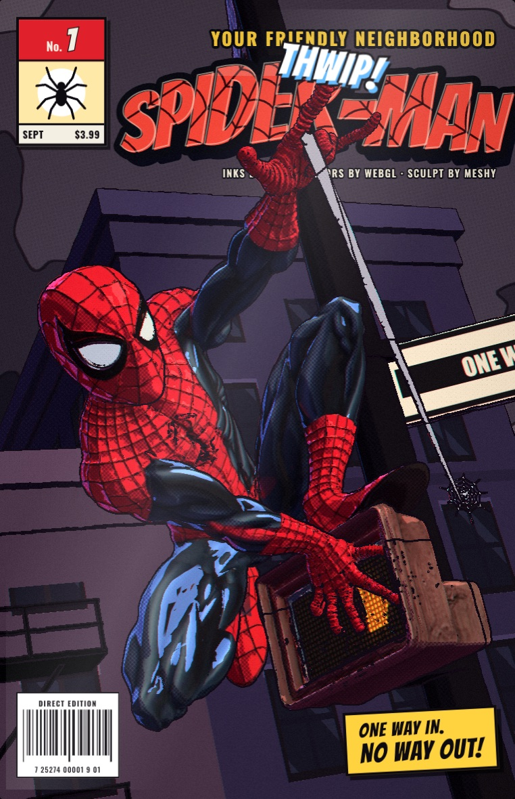

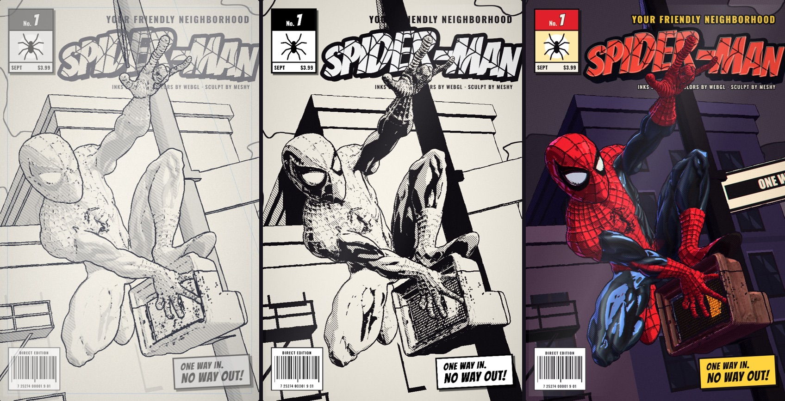

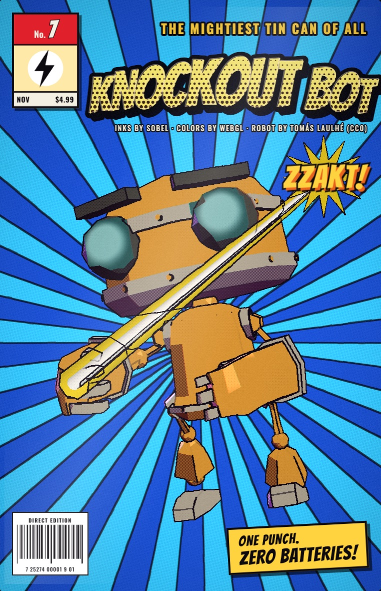

- `SKILL.md`: how the look is built, the workflow (scaffold → probe the model → config → frame → exercise every interaction), composition rules for covers, and the rules of the look.
- `engine/`: the shared renderer (one MRT pass → ink/halftone/hatching composite), sets, masthead, effects, synthesized sound, plus `probe.html`, a model inspector that puts five orthographic views on model-space grids and raycasts any pixel to an exact point.
- `template/index.html`: a cover is this page plus a `window.COVER` config.
- `examples/spider-man/`, `examples/robot/`: a Meshy sculpt with a web power, a walk-signal decal and a clickable prop; a rigged CC0 robot frozen mid-punch with a beam and glowing eyes.
- `scripts/`: `new-cover.sh` (scaffold), `build-model.sh` (OBJ/FBX/glTF/GLB → one small meshopt GLB), `shot.mjs` (GPU headless screenshots with JS between frames; no npm deps), `serve.mjs`, `sync-engine.sh`.
- `references/config.md`, `references/pipeline.md`: every config field; how the render works, how to extend it, and the traps already hit.

**Controls:** move the mouse to tilt the cover; drag to orbit (springs back); click a building, the sky, the hero or a prop; `1` `2` `3` switch Pencils / Inks / Colors; the sense key; `M` mutes.
**URL options:** `?az= &el= &roll= &dist= &fov=` camera, `?seed=N` city layout, `?stage=0|1|2`, `?still` (no drift, boil or ambient lightning).

The robot is [RobotExpressive](https://github.com/mrdoob/three.js/tree/dev/examples/models/gltf/RobotExpressive) by Tomás Laulhé (CC0), modified by Don McCurdy. The Spider-Man sculpt is fan art made with Meshy AI; Spider-Man is a trademark of Marvel.

## scientific-figure-making


- `SKILL.md`: when to load it (matplotlib figures with a publication target) and when not to (Plotly/Altair/Bokeh, EDA-only plots, 3D/GIS, Figma-first infographics).
- `references/design-theory.md`: the house style measured from the real scripts: fonts and sizes, spines, the blue/green/red/neutral palette and what each colour means, export DPI, layout rules.
- `references/api.md`: `PALETTE`, `FigureStyle` and the helper signatures (`apply_publication_style`, `make_grouped_bar`, `make_trend`, `make_heatmap`, `finalize_figure`…) to implement per project.
- `references/common-patterns.md`: ultra-wide panels, a legend-only axis, hidden category ticks, tight y-limits, black edges and hatching so bars survive grayscale print.
- `references/tutorials.md`: grouped bars, multi-panel trends with a legend column, a labelled heatmap.
- `references/demos.md`: links to the upstream `figure_*` folders, the canonical scripts behind the style.

Copied unchanged from [ChenLiu-1996/figures4papers](https://github.com/ChenLiu-1996/figures4papers/tree/main/scientific-figure-making) (`3c181f8`) by [Chen Liu](https://chenliu-1996.github.io/). Licensed CC BY-NC 4.0, not MIT: see the skill's `LICENSE`. The preview images are upstream's `figure_ImmunoStruct` and `figure_ophthal_review` outputs.

## dither-reveal

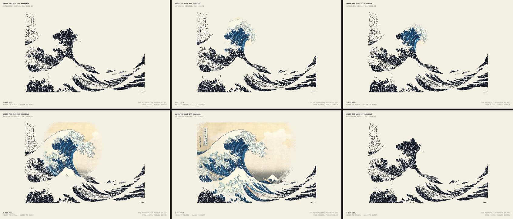

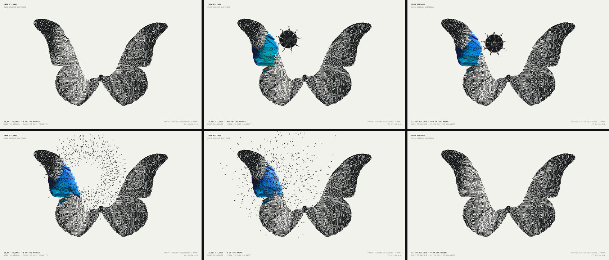

*Each sheet: idle, sweeping, parked, click, click + 0.5 s, healed, captured by `scripts/shot.mjs`.*

- `SKILL.md`: how both modes work, the workflow (image → scaffold → tune → contact sheet), rules and limits.
- `template/`: the engine (`engine.js`, both modes, no dependencies) and a page shell configured through `window.DITHER`.
- `scripts/new.sh <dest> <image> [veil|filings]`: scaffold a page from any image. `prep-image.py` cuts the subject off a plain background and embeds it, so the page runs from `file://`.
- `examples/`: `great-wave` (veil), `morpho` (filings), `geode` (a standalone raymarched specimen plate with a cross-section lens, a scroll-controlled cut and click-to-split).

**Controls:** move to reveal or gather filings, click to burst or flip polarity. On the geode, scroll moves the cut.

Inspired by a screen recording of a "Dither Veil" hover demo; the code is original. The Great Wave is from [The Met's Open Access collection](https://www.metmuseum.org/art/collection/search/45434) (public domain). The morpho photo is by [Didier Descouens / MHNT](https://commons.wikimedia.org/wiki/File:Morpho_rhetenor_rhetenor_MHNT_dos.jpg), [CC BY-SA 4.0](https://creativecommons.org/licenses/by-sa/4.0/).

## pixel-rebuild


*A 15.5 s reel of a pixel-art tower rebuilt as a canvas page, exported with `scripts/check.py --gif`. In Chrome, each frame averages 0.26 clearly wrong pixels out of 52,900.*

- `SKILL.md`: how the grid is found and the clip is split into a background, sprites and a palette; the workflow (contact sheet → extract → check images → Chrome check); how to read the log, the knobs, and the traps already hit.
- `scripts/extract.py <clip> --out <dir>`: a video, GIF or screen recording in; `data.js` and the player out. It handles non-integer upscales, offsets, non-square art, and 30/60 fps recordings of slower art.
- `scripts/check.py <dir> [--gif out.gif]`: compares every rendered frame with the source in real Chrome, times playback, and writes a GIF with per-frame holds.
- `template/index.html`: the zero-dependency player.

**Controls:** space to pause, ← → to step, `m` for sound (when the clip has audio).
**URL options:** `?f=N` opens paused on frame N; `window.pixel.seek(n)` from the console.

The tower art isn't mine. It's rebuilt from a pixel-art reel by its original artist and shown here only to demo the pipeline. The code is original.

## postage-collage

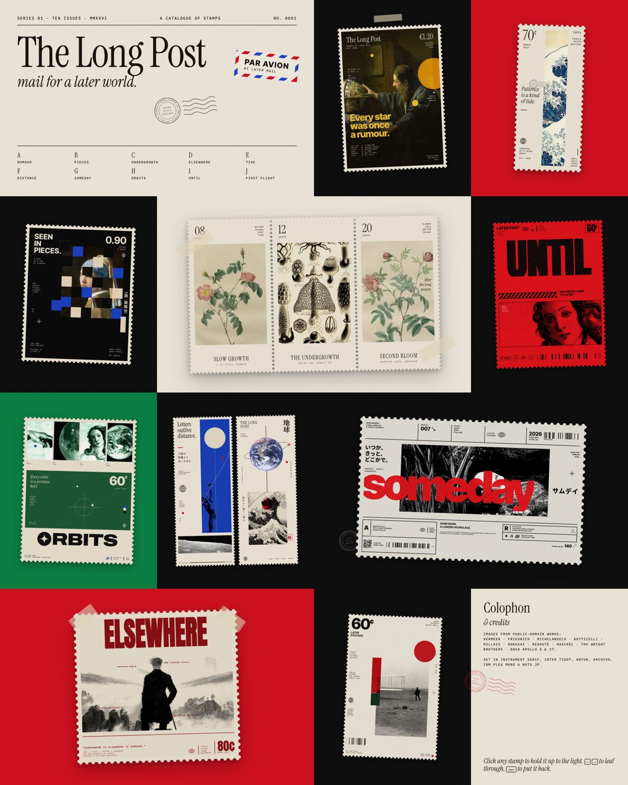

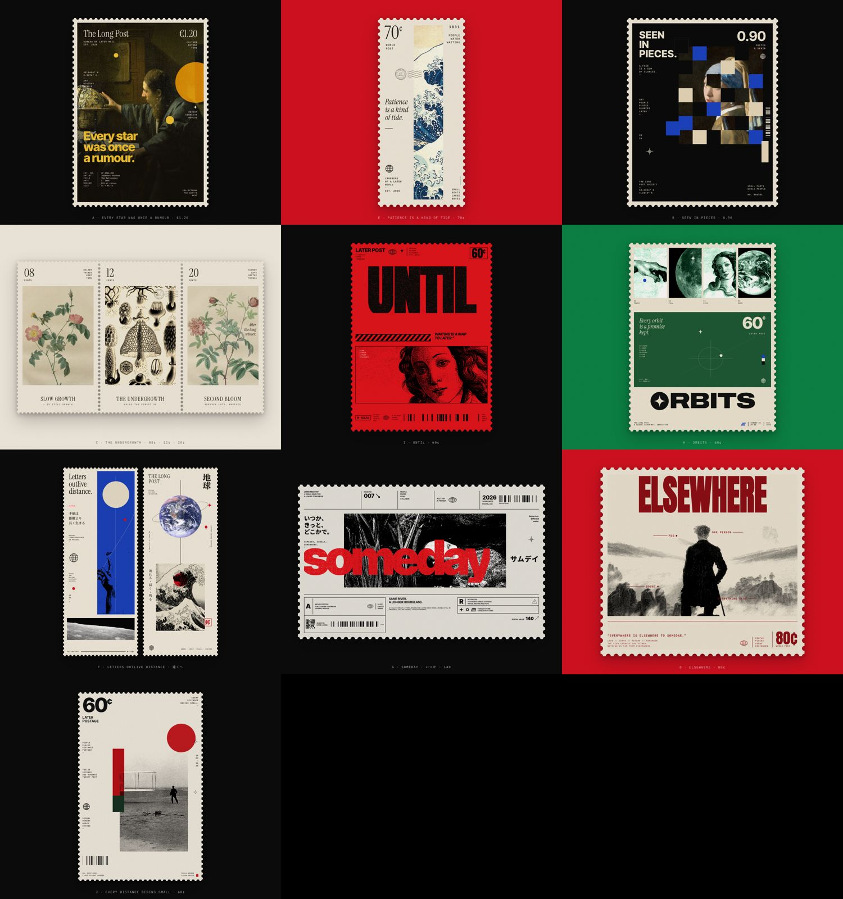

- `SKILL.md`: what makes these read as stamps (perforation, denomination, stacked micro-copy, one human line, treated imagery), the workflow (reference frames → concept → images → scaffold → write → screenshot check), the system rules, and image lessons.
- `references/families.md`: the ten families: the parts of each, sizes, the image it needs, the treatment and the copy rules.
- `assets/stamp.css` + `stamp.js`: the shared runtime: perforation mask, paper grain, speckle, icon kit and postmark, seeded barcodes and QRs, pixel-fragment grids, entrance and zoom view.
- `template/`: the page shell plus one snippet per family. `scripts/new.sh <dest> [family …]` puts together a page that renders immediately.
- `scripts/images.py`: Wikimedia Commons search and fetch, then crop and grain from a `recipes.json` (duotones are CSS blend modes, so one bw file serves every palette). `ref-frames.sh` pulls unique designs out of a reference reel, and `shot.sh` makes desktop, phone and per-stamp screenshots.
- `examples/the-long-post/`: the finished set, "mail for a later world".

**Controls:** hover lifts a stamp; click opens it full-screen; ← → leaf through; `esc` closes.
**URL options:** `?z=N` opens stamp N, `?still` skips the entrance animation.

Inspired by a reel of editorial stamp designs; the stamps, copy and code are original. Every image is public domain: Vermeer, Friedrich, Michelangelo, Botticelli, Millais, Hokusai, Redouté, Haeckel, the Wright brothers (1903) and NASA Apollo 8 and 17, via Wikimedia Commons.

## motion-reel

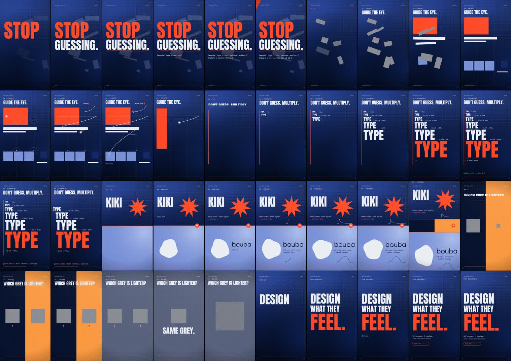

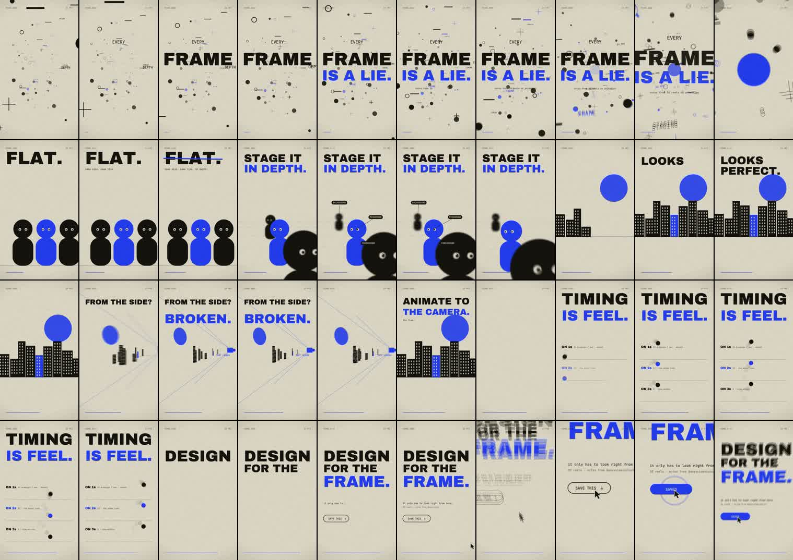

- `SKILL.md`: the workflow (brief → timing table → theme → edit scenes → music map → preview stills → render → verify → compare versions), and engine notes (skia + ffmpeg pipe, a tiny pinhole 3D camera with perspective cards, depth of field, sub-frame motion blur, on-twos timing, grain blend modes, SFX synthesis).
- `templates/flat-poster/`: *STOP GUESSING*. Hook slam, Gestalt layout snapping to a thirds grid with an F-path eye trail, a ×1.618 type ladder, kiki vs bouba easing, colour-is-relative, and a match cut to the end card. Procedural 120 BPM sound design.
- `templates/depth-camera/`: *EVERY FRAME IS A LIE*. A Fight-Club-style dive, flat → foreground/mid/background staging with depth of field and parallax, a city that is perfect from the shot camera and broken when the camera orbits, ones/twos/threes, and a cursor click with auto-zoom. Cut to Mixkit's "Stylz".
- `references/lessons.md`: design and animation rules learned from 30 @aevyvideoschool reels, a checklist, and an honest comparison of the two templates. `references/styles.md`: the 11 visual styles those reels use, one card per reel, and a build recipe per style.
- `scripts/`: `fetch-fonts.sh` (OFL fonts), `study-reels.sh` (contact sheets, cut counts, 4 fps bursts of reference videos), `pick-music.py` (list and fetch Mixkit tracks, BPM and steadiness, a 0.25 s energy/kick map, a 20 s loudness-normalised cut).

Made by studying a set of motion-design tutorial reels frame by frame, then rebuilding what they teach as code. Music isn't included: Mixkit tracks are free to use but not to redistribute, so `pick-music.py` fetches them.

## signal-print

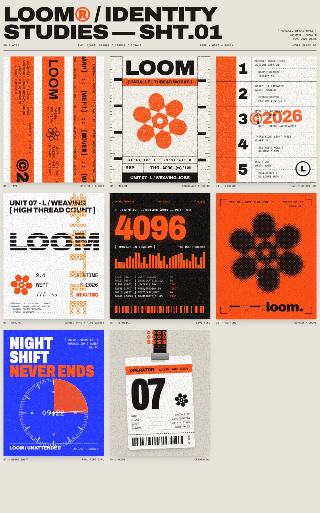

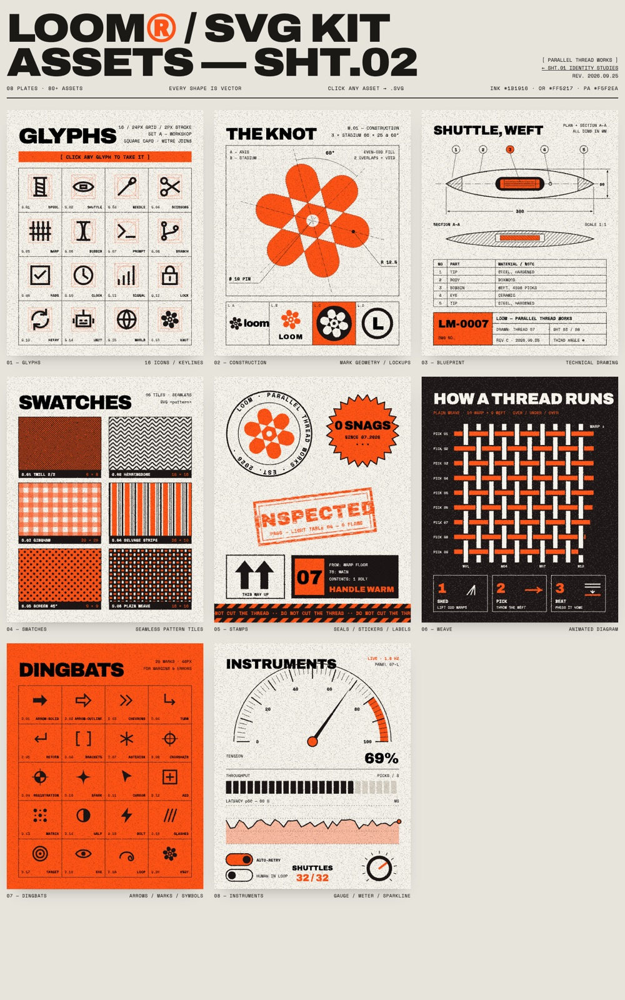

- `SKILL.md`: the workflow (read references → invent a product and one metaphor → design a one-path mark → scaffold → rewrite copy → screenshot check) and the short rules of the look.
- `references/grammar.md`: tokens, type, copy rules, how every plate on both sheets is built, the SVG export, and the traps already hit.
- `examples/loom/identity.html`: eight HTML/CSS/canvas plates sized in container units.
- `examples/loom/svg-kit.html`: eight all-SVG plates. Every asset is a nested svg; clicking one downloads it, with its patterns, markers and filters included.
- `scripts/new.sh <dest> --name X --accent '#hex'`: copies both sheets and swaps the wordmark and colours. `scripts/shot.sh`: full-sheet headless Chrome screenshot.

**Controls:** hover plate 06 on sheet 01 for the halftone loupe; hover and click any asset on sheet 02 to download it.

Inspired by grainy orange agent-deployment posters from a dev-tool launch campaign; the brand (LOOM), mark, copy and code are original.

## isometric-svg


- `SKILL.md`: the look, the workflow (reference → axes → block out → painter's order → pure `state(t)` → verify) and the lessons that each cost a round trip (near-miss alignment, the twin bug, props left in a lane, loop seams, lap fractions that must wrap).
- `template/iso.js` + `template/index.html`: the engine (projection, `box`, `extrude`, `cylinderU`, `tube`, `slab`, `clipD`…) and a starter scene with a freeze hook and light/dark tokens.
- `examples/filing-cabinet.html`: drag the drawers out by their handles; hanging folders sway with inertia.
- `examples/pit-wall.html`: pit stop (jacks swing in from one side, four-corner tyre change, pit light, rivals in the fast lane), scrutineering gantry with a red glow, circuit map with DRS and pit lane, telemetry strip chart and steering-wheel display, wind-tunnel streamlines with DRS, tyre temps and brakes, timing tower — all on one clock. Cars, numbers and codes are fictional.
- `references/primitives.md`, `references/verification.md`: the API and painter's order rules, and the scripted checks (collisions, crossings, monotonic motion, loop seams) that caught real bugs.
- `scripts/shoot.py`: `uv run` it to freeze a page at a list of times and tile a contact sheet; fails on console errors.

Inspired by a screen recording of an isometric SVG filing cabinet and a pit-wall illustration; the code and scenes are original.

## motion-replica

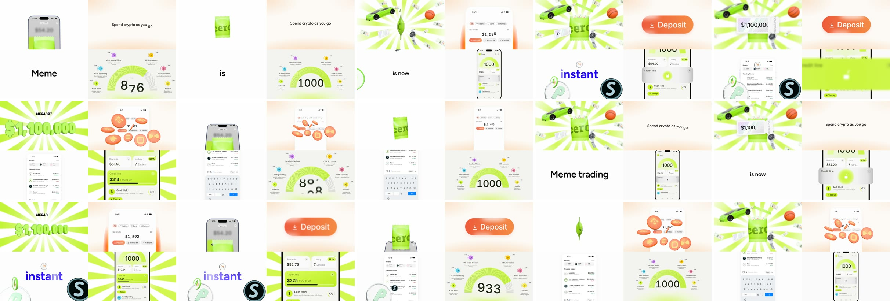

- `SKILL.md`: the workflow (measure → beat tables → scaffold → build flat and compare stills → 3D lookdev → motion sheets → final render and an honest diff report) and the principles behind it.
- `scripts/`: `study.py` (spec, per-cell loop periods and cuts, contact sheets, `--burst` strips for reading curves), `render.py` (page → MP4 or stills on the real GPU, audio muxed, `--probe`), `compare.py` (reference | replica stills and per-cell motion sheets), `prep-glb.sh` (meshopt + webp, material names kept, base64-embedded), `font2typeface.py` (any TTF → three.js 3D type).
- `templates/replica/`: `lib/replica.js` (pure-`t` timeline core, easing, number-flow odometer, sunburst, UI icons, boot), `assets/assets3d.js` (the 3D kit: crimped pouch, bills and stacks, basketball, diver's watch, lathed coins incl. glass-glyph and cel-shaded, bevelled digits, GLB loader), a demo page and a lookdev sheet.
- `examples/cero-grid/`: four independently looping cells (a pack-opening prize burst, a deposit flow with coin burst, meme-token search with coins flying into the list, a credit score gauge unlocking a credit line). Run `./fetch-assets.sh` once for the car.
- `references/`: `study.md` (reading timing, curves, counters, colour and type off frames), `timeline.md` (layers, coordinates, beat recipes), `3d-assets.md` (kit API, material recipes, licence-clear model sourcing), `gotchas.md`.

Made by rebuilding a 10 s grid ad frame by frame. The example's brand names come from that reference; the code and 3D assets are original, and the car is "Car Concept" by Eric Chadwick / Darmstadt Graphics Group (CC-BY 4.0), fetched at setup, not stored in the repo.
