# creative-skills

[Claude Code](https://claude.com/claude-code) skills I've made. Each one lives in `skills/<name>/` and is self-contained: a `SKILL.md` plus templates, examples and references.

| skill | what it does |
|---|---|
| [riso-rooms](skills/riso-rooms) | Isometric illustrations that look risograph-printed: cutaway rooms with halftone inks, misaligned plates and wobbly lines, drawn in code on a canvas you can pan and zoom. |
| [logo-intro](skills/logo-intro) | A kinetic name/logo intro in plain JS: atom rings, hyperspace warp, flash, letters popping in with doodles, a boiling highlight box, a wipe to a sparkle. |
| [hand-drawn-canvas-animation](skills/hand-drawn-canvas-animation) | Hand-drawn short films drawn in Canvas 2D JavaScript: whole-pose character drawings, ink, pencil, riso, screen print or brush-pen doodles on photos, plus rotoscoped real motion, sand animation and a pop-up paper book, rendered to mp4 with a generated Web Audio score. |
| [ink-abstraction](skills/ink-abstraction) | A 12-panel pen-and-ink abstraction sheet of any subject in vanilla JS: hatched sketch → black masses → cross-stitch grid → patterned cells → a few lines and one knot. |
| [morph-tile-loop](skills/morph-tile-loop) | Seamless geometric loops in vanilla JS: a dot opens into layered rings, morphs into a gradient star, zooms out over an endless lattice into halftone, and dives back in. |
| [iso-sim-town](skills/iso-sim-town) | A playable late-90s isometric sim town in vanilla JS: pre-rendered-looking buildings, baked shadows, dithered 256-colour pixels, traffic, day/night, a Props window and a Windows 98 UI. |
| [morning-debrief](skills/morning-debrief) | A daily brief page for a project: one self-contained HTML file with a public-domain painting header, the one thing to push forward, to-dos with sources, what's waiting on other people and what changed — built from Slack, meeting notes, calendar, git and local checklists, and installable as a scheduled run. |
| [slide-craft](skills/slide-craft) | Presentations as one self-contained HTML deck: fixed 1280×720 slides, thumbnail rail, presenter mode with notes, print to PDF — plus the thinking first (audience, the one sentence, the ask) and a list of the things that make slides look generated. |
| [pixel-showcase](skills/pixel-showcase) | A gacha-style "who's that?" reveal for pixel sprites: hold to charge a silhouette through rarity colours, then it bursts into its own pixels and reassembles in colour, with a stat card, NEW/SHINY stamps, a dex and chip-tune sound. Templates for animated Gen 1 Pokémon (live from PokeAPI) and procedurally generated creatures. |
| [sketchbook-portfolio](skills/sketchbook-portfolio) | An illustrated personal portfolio in plain HTML/CSS/JS: a red sketchbook hero with boiling hand-drawn SVG, stamp borders and chalk doodles, Lenis smooth scroll, a 3D-hinged page, notes that pin mid-screen while polaroids parallax past, project cards that land on a tilting grid board, nav hover doodles and click ink bursts. |
| [xray-scroll](skills/xray-scroll) | A scroll-driven x-ray film from any 3D model: three.js renders it see-through with dark rims and a floor reflection, it assembles part by part as GSAP ScrollTrigger scrubs one timeline over Lenis smooth scroll, and it cuts through pixel-mosaic, green dot-grid, red scanline, NO SIGNAL and datamosh glitches, with green tracking boxes, decoding captions and a timecode HUD. Single merged meshes (AI sculpts, scans) are split into parts automatically. |
| [scientific-figure-making](skills/scientific-figure-making) | Publication-ready matplotlib figures for papers, slides and reports: grouped bars, trends, heatmaps and multi-panel layouts in one house style (palette, fonts, spines, legend panels, print-safe hatching, vector export). By Chen Liu, from [figures4papers](https://github.com/ChenLiu-1996/figures4papers). |

## Install

Clone once, then link the skills you want:

```sh
git clone https://github.com/IshaanKalra2103/creative-skills ~/src/claude-skills
ln -s ~/src/claude-skills/skills/riso-rooms ~/.claude/skills/riso-rooms
ln -s ~/src/claude-skills/skills/logo-intro ~/.claude/skills/logo-intro
ln -s ~/src/claude-skills/skills/hand-drawn-canvas-animation ~/.claude/skills/hand-drawn-canvas-animation
ln -s ~/src/claude-skills/skills/ink-abstraction ~/.claude/skills/ink-abstraction
ln -s ~/src/claude-skills/skills/morph-tile-loop ~/.claude/skills/morph-tile-loop
ln -s ~/src/claude-skills/skills/iso-sim-town ~/.claude/skills/iso-sim-town
ln -s ~/src/claude-skills/skills/pixel-showcase ~/.claude/skills/pixel-showcase
ln -s ~/src/claude-skills/skills/sketchbook-portfolio ~/.claude/skills/sketchbook-portfolio
ln -s ~/src/claude-skills/skills/scientific-figure-making ~/.claude/skills/scientific-figure-making
ln -s ~/src/claude-skills/skills/xray-scroll ~/.claude/skills/xray-scroll
```

Then ask Claude Code for one (e.g. "make an animated intro for my name") or run `/logo-intro`, `/riso-rooms`.

---

## riso-rooms

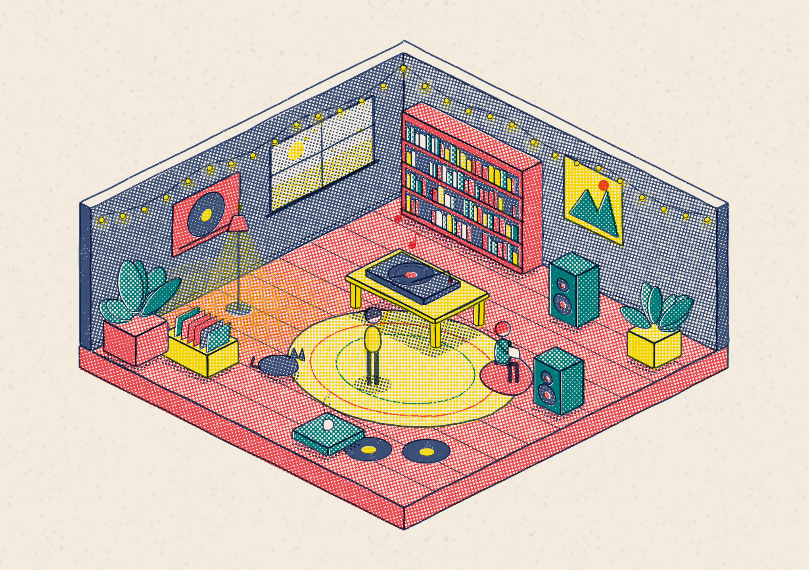

*`examples/listening-room.html`: records spinning, string lights twinkling, a dancer, a cat. Every mark is drawn in code.*

- `SKILL.md`: the rules for the look, the workflow (plan rooms → block out → screenshot → add clutter → animate), and guidance on scale, density and tone.
- `template/index.html`: a zero-dependency engine plus two example rooms.
- `examples/listening-room.html`: a full single-room scene (the image above).
- `references/api.md`: the drawing API (boxes, walls, windows, bookcases, lamps, plants, people in 6 poses, light, steam…).

**Controls:** drag or scroll to pan and zoom, pinch on touch, WASD to move, `0` to fit, `P` to save a PNG, double-click a room to fly to it.
**URL options:** `?room=<id>`, `&zoom=N`, `?frame=N` (freeze time), `?still` (no idle tour).

Inspired by Kevin Ngo's ["a small light, room by room"](https://a-small-light-three.vercel.app/) ([tweet](https://x.com/kevin_t_ngo/status/2100238648218427563)). The engine and scenes here are original code.

## logo-intro

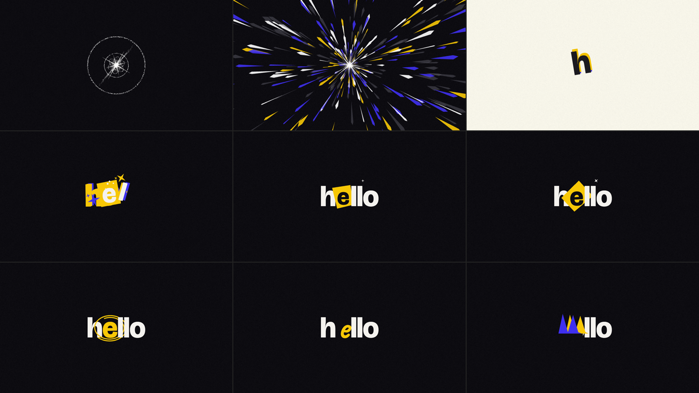

- `SKILL.md`: the stage timeline, how to retime or cut stages, the rules of the look, and how to check it with frozen-frame screenshots.
- `template/index.html`: the whole animation (~350 lines of canvas JS, no libraries).

**Controls:** click or space to replay.
**URL options:** `?name=ada`, `&accent=0` (which letter gets the box), `&yellow=ff5a36&blue=00a37a` (any palette key, hex without `#`), `&speed=0.8`, `?t=9` (freeze time).

Made by rebuilding a reference motion-graphics intro frame by frame in JavaScript.

## hand-drawn-canvas-animation

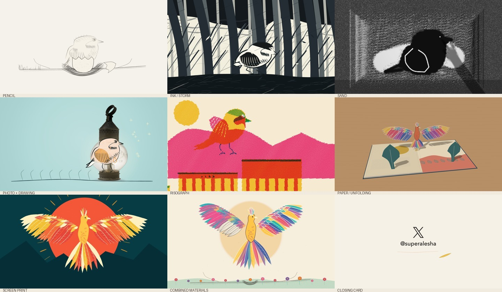

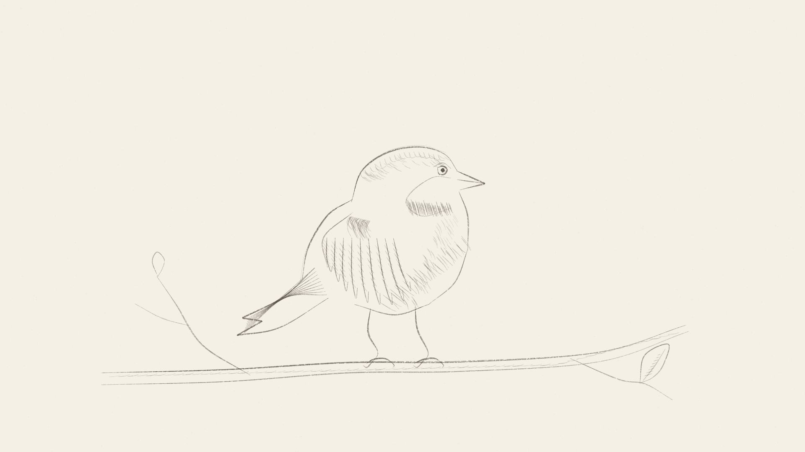


- `SKILL.md`: the procedure (brief → beat sheet → palette → key poses → scenes one at a time → full render → score), the rules and a review checklist.
- `assets/core.js` + `assets/film-template.html`: the shared core (palettes, finishes, marks, reveals, photos and doodles, camera, timeline, player) and the file you copy per film. Engines that load beside it: `roto.js` (found motion traced from video), `sand.js` (a sand bed on backlit glass), `paper3d.js` (pop-up pages in a 3D room), plus `cels.js`, `materials.js` and `studio.js`.
- `examples/`: `becoming-phoenix/`, a 60 s film that moves through five drawing styles, sand and a pop-up book; `sketchbook-bird.html`, a whole-pose pencil study; the fruit fly, four looks, museum-photo doodles and night chase; gallop, paper horse, moon book, one seed, one year, weight and material studies; and `workshop.html`, a point-and-click screen that drives the film engine.
- `scripts/`: `render.mjs` (frame grid, spot frames, mp4 on twos with the score, contact sheet), `verify.mjs`, `photo.mjs` (cut a photo out of its background) and `roto.py` (trace motion from a video).
- `references/`: style rules, palettes, redrawn animation, motion, mixed media, found motion, sand, paper3d, studio, the doodle look, architecture and pitfalls.

Needs Node 18+, Chrome and ffmpeg; the doodle look cuts photos best with `rembg` on PATH. `cd` into a film folder with `core.js`, `render.mjs` and `package.json`, `npm i`, then `node render.mjs film.html --grid 24`.

Synced from [alesha-pro/tools](https://github.com/alesha-pro/tools/tree/main/skills/hand-drawn-canvas-animation) (MIT, see the skill's `LICENSE`). The first looks are rebuilt from Kevin Ngo's films ([the life of a fruit fly](https://x.com/kevin_t_ngo/status/2099858454043349342), [doodles on photos](https://x.com/kevin_t_ngo/status/2100601972902842517) and others).

## ink-abstraction

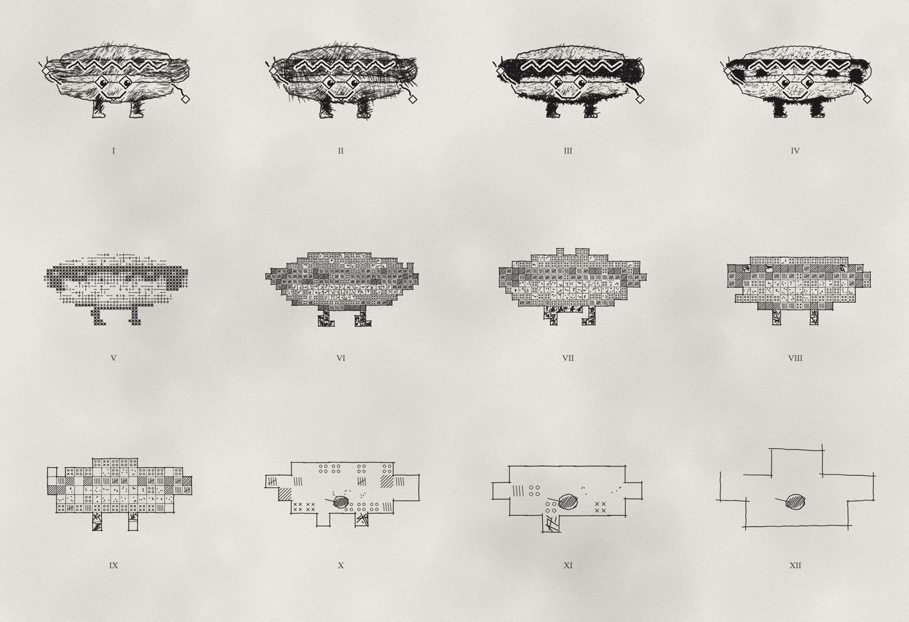

- `SKILL.md`: how to describe a subject (silhouette polygons, a shade field, detail strokes, an anchor), the rules of the look, and how to check it with a headless screenshot.
- `assets/engine.js`: the twelve stages, paper, boil and controls, no libraries. A subject file calls `defineSheet({...})`.
- `examples/`: a grazing bull and a cartoon hot dog. `scripts/shot.sh`: screenshot a sheet with headless Chrome.

**Controls:** click for a new variation, `B` toggles the boil. **URL options:** `?still`, `?seed=N`.

## morph-tile-loop

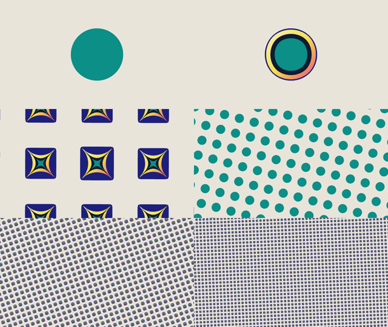

- `SKILL.md`: how the loop works (layered superellipses, keyframed channels, log zoom, symmetric spin), the workflow for matching a reference video, and the rules of the look.
- `assets/engine.js`: timeline, zoom, square/hex lattice, shape drawing and controls, no libraries. A loop file calls `defineLoop({...})`.
- `template/index.html`: teal circle → gradient star in a navy square → halftone → back, 8 s.
- `examples/hex-bloom.html`: a riso palette on a hex lattice with six-point shapes (`assets/hex-bloom.png`).
- `scripts/shot.sh`: a contact sheet of frozen frames, or `--mp4` for a full render with headless Chrome + ffmpeg.

**Controls:** space pauses. **URL options:** `?t=3.2` (freeze time), `?speed=0.5`.

Made by rebuilding a reference motion loop frame by frame in JavaScript.

## iso-sim-town

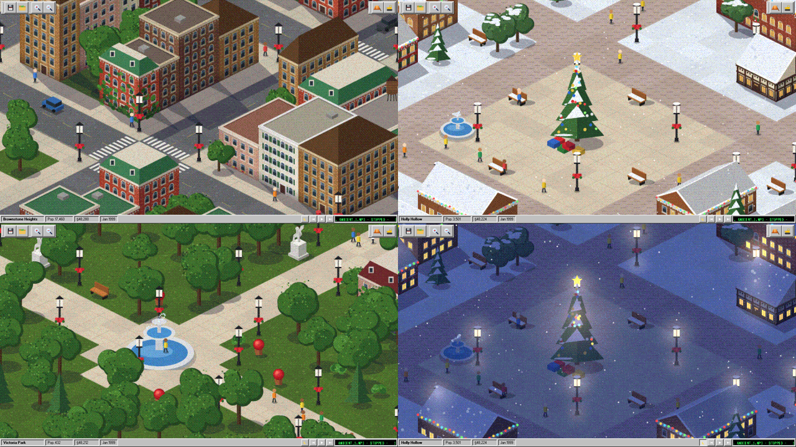

- `SKILL.md`: the five-stage pipeline behind the pre-rendered look (native 64×32 iso, baked lighting, grain textures, low-res nearest-neighbour upscale, ordered-dither palette), the workflow for laying out a town, and the rules of the look.
- `assets/engine.js`: renderer, building painter, props, traffic, pedestrians, Props window, bulldozer, day/night, save, generated ambient music and the Win98 UI, no libraries. A town file calls `defineTowns([...])`.
- `template/index.html`: one brownstone city with taxis, pedestrians and parks.
- `examples/three-towns.html`: the city plus a snowy Christmas village and a Victorian park.
- `scripts/shot.sh`: a contact sheet of views with headless Chrome, printing console errors.

**Controls:** drag or WASD to pan, wheel or `+`/`-` to zoom, hard-hat opens Props (click to place), bulldozer removes, moon toggles night, `P` pixel size, `X` dither, `M` or `1`–`9` switch towns.
**URL options:** `#2` (open town 2), `#2n` (at night).

Made by rebuilding a reference video of an isometric town builder in JavaScript.

## License

MIT, except skills that ship their own `LICENSE`: hand-drawn-canvas-animation (MIT, Alexey Fateev) and scientific-figure-making (CC BY-NC 4.0, Chen Liu).

## pixel-showcase

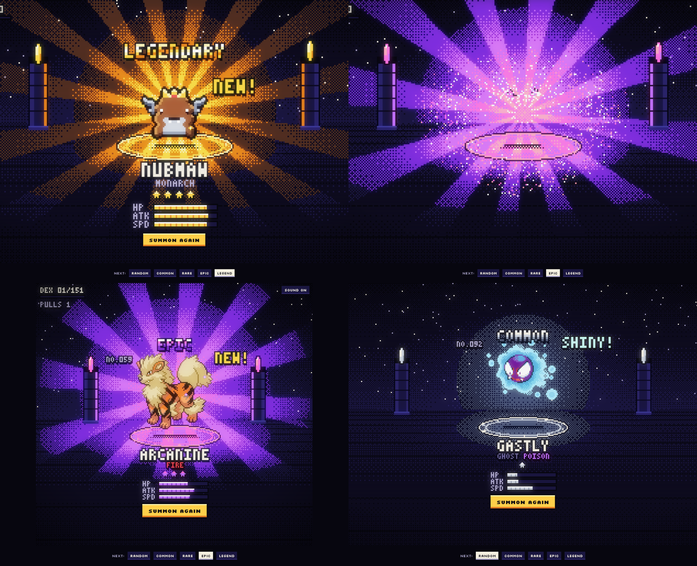

*Clockwise from top left: a generated legendary, the pixel burst on an epic pull, a shiny Gastly, Arcanine's card.*

- `SKILL.md`: the reveal phases, rarity rules, how to plug in your own game's sprites (GIFs or sheets), and how to verify it with screenshots.
- `template/pokemon.html`: 151 Gen 1 Pokémon with their animated Black/White sprites, shinies (1/16), types, stats and cries, fetched live from [PokeAPI](https://pokeapi.co). Nothing Pokémon is bundled in the repo.
- `template/creatures.html`: 30 seeded species (bodies, eyes, wings, horns, crowns by rarity) that blink and breathe. Works offline.

**Controls:** press and hold anywhere (or hold Space) to charge; tap the revealed sprite to poke it; the bottom pills force the next rarity; mute top right.

Inspired by my own pixel loot-card opener. Pokémon © Nintendo / Game Freak / The Pokémon Company; this is a fan toy.

## sketchbook-portfolio

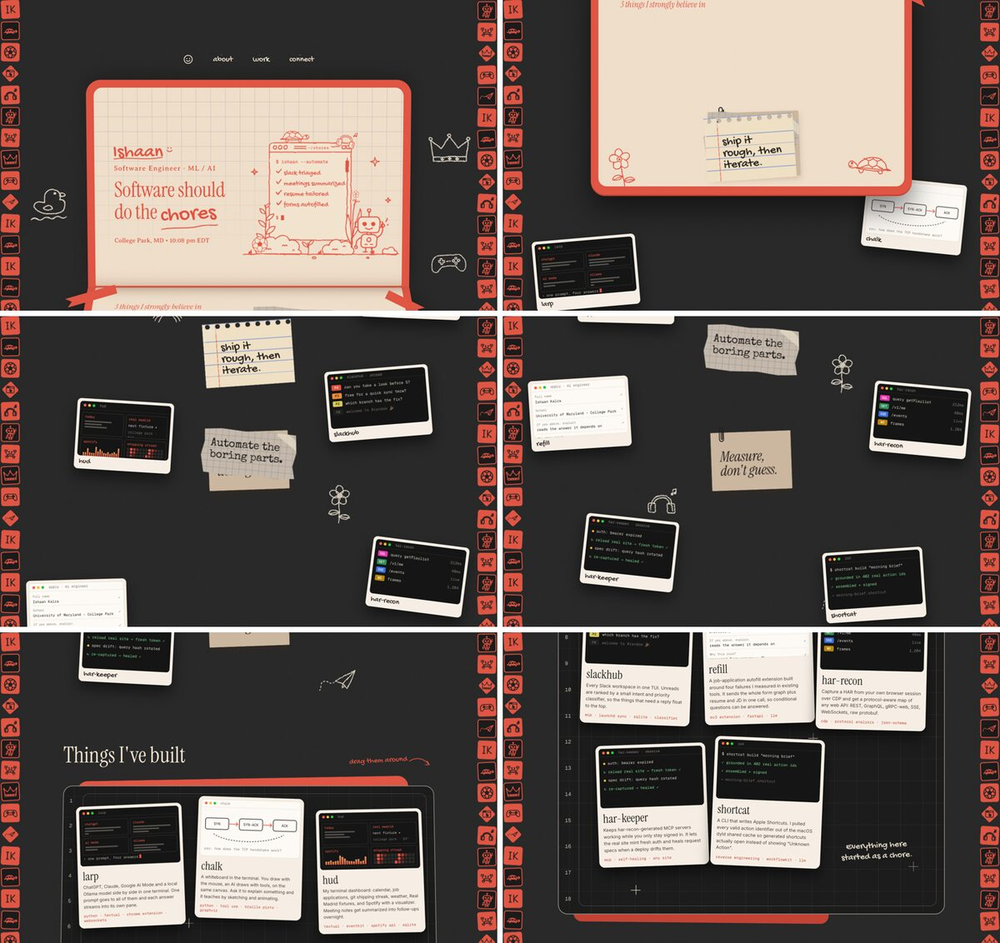

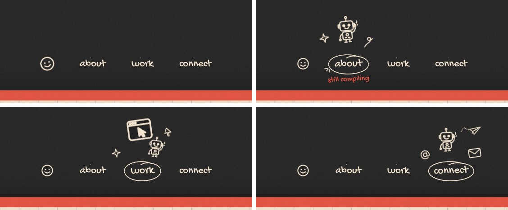

- `SKILL.md`: the sections and what moves in each, the workflow (collect real facts → fill the template → draw the person's own doodles → verify), how to draw doodles that boil, the scroll tuning knobs, and gotchas.
- `template/`: the placeholder site. `styles.css` + `main.js` are the engine (identical everywhere); `index.html` holds the content, the SVG doodle library and `window.SITE`.
- `examples/ishaan/`: my own site built from it.
- `scripts/shot.mjs`: screenshots at scroll positions, each nav hover, or phone size, tiled into a contact sheet, with console errors. Node 22+, Chrome and ffmpeg, no npm deps.

**Controls:** scroll; hover the nav and the stamps; drag the project cards once they land; tap the ball.
**URL options:** `?y=1800` opens a static frame at that scroll position (no smooth scroll), for screenshots.

Inspired by [Jackie Zhang's portfolio](https://jackiezhang.co.za/). The code and illustrations are original.

## xray-scroll

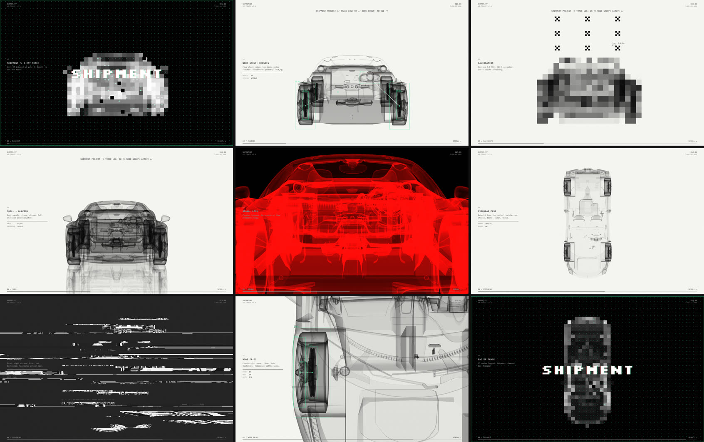

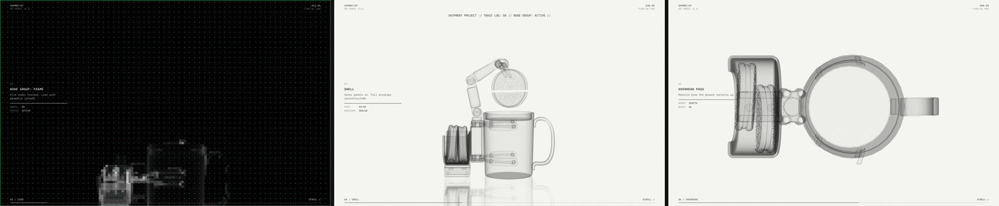

- `SKILL.md`: how the x-ray and the glitches are built, the workflow (scaffold → stage the build → contact sheet → captions), rules and limits.
- `template/`: `engine.js` (renderer, x-ray and glitch shaders, model normalising/splitting/staging, tracker HUD, Lenis + ScrollTrigger) and `styles.css` are shared; `film.js` (the storyboard, one 100-unit GSAP timeline) and `index.html` (`window.XRAY` config, captions) are per film.
- `examples/shipment/`: the reference film, an x-ray Ferrari that assembles wheel-first.
- `scripts/`: `new-film.sh` (scaffold), `glb-parts.mjs` (node names as three.js sees them), `shot.mjs` (GPU headless screenshots at timeline points, tiled into a contact sheet; no npm deps), `serve.mjs`, `sync-engine.sh`.
- `references/config.md`, `references/film.md`: every config field; state keys, effect recipes, the storyboard beat by beat, and the traps already hit.

**Controls:** scroll (scrolling fast tears the image).
**URL options:** `?p=NN` jumps to NN% of the film; `?parts` logs how the model was split and staged.

Inspired by a reference clip of an x-ray car ("SHIPMENT PROJECT // TRACE LOG"); the code is original. The Ferrari 458 Italia model is by [vicent091036](https://sketchfab.com/models/57bf6cc56931426e87494f554df1dab6), from the three.js examples. It's loaded from the three.js repo, not copied here. The coffee machine is `coffeemat.glb` from the three.js examples.

## scientific-figure-making


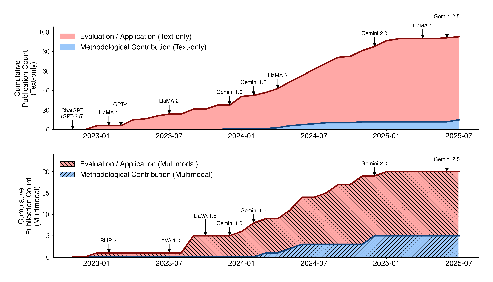

- `SKILL.md`: when to load it (matplotlib figures with a publication target) and when not to (Plotly/Altair/Bokeh, EDA-only plots, 3D/GIS, Figma-first infographics).
- `references/design-theory.md`: the house style measured from the real scripts: fonts and sizes, spines, the blue/green/red/neutral palette and what each colour means, export DPI, layout rules.
- `references/api.md`: `PALETTE`, `FigureStyle` and the helper signatures (`apply_publication_style`, `make_grouped_bar`, `make_trend`, `make_heatmap`, `finalize_figure`…) to implement per project.
- `references/common-patterns.md`: ultra-wide panels, a legend-only axis, hidden category ticks, tight y-limits, black edges and hatching so bars survive grayscale print.
- `references/tutorials.md`: grouped bars, multi-panel trends with a legend column, a labelled heatmap.
- `references/demos.md`: links to the upstream `figure_*` folders, the canonical scripts behind the style.

Copied unchanged from [ChenLiu-1996/figures4papers](https://github.com/ChenLiu-1996/figures4papers/tree/main/scientific-figure-making) (`3c181f8`) by [Chen Liu](https://chenliu-1996.github.io/). Licensed CC BY-NC 4.0, not MIT: see the skill's `LICENSE`. The preview images are upstream's `figure_ImmunoStruct` and `figure_ophthal_review` outputs.
