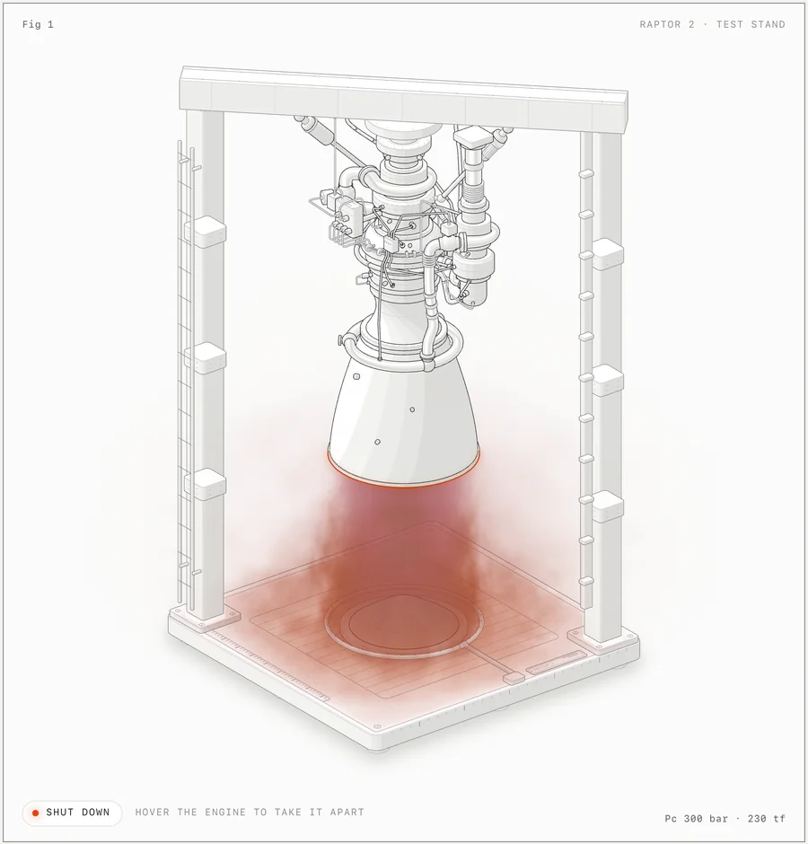
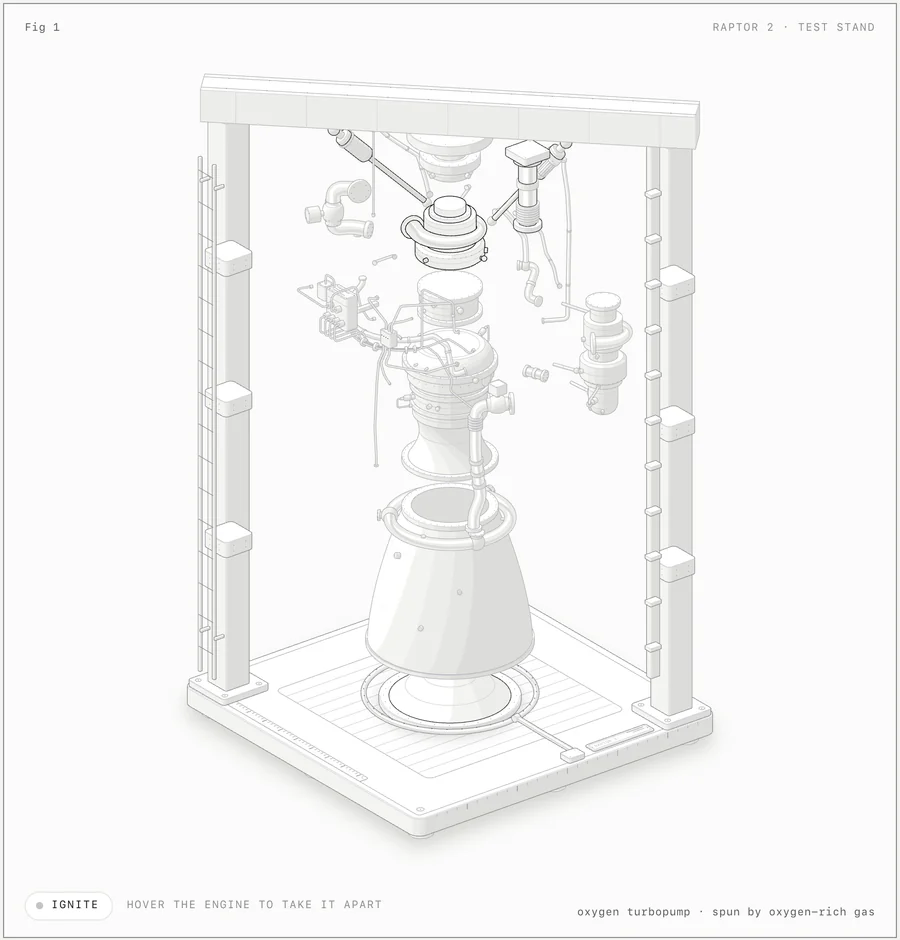
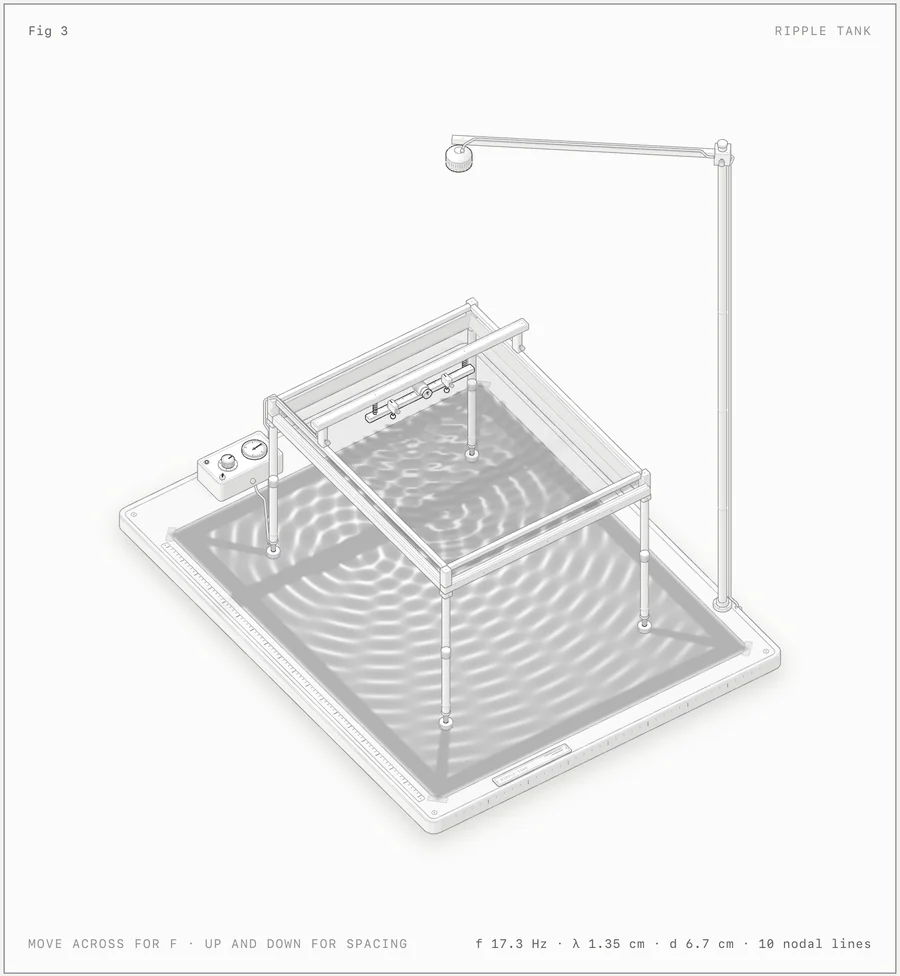
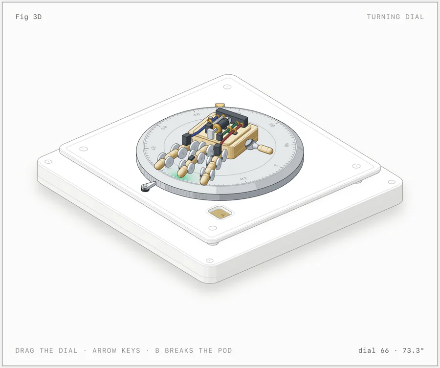
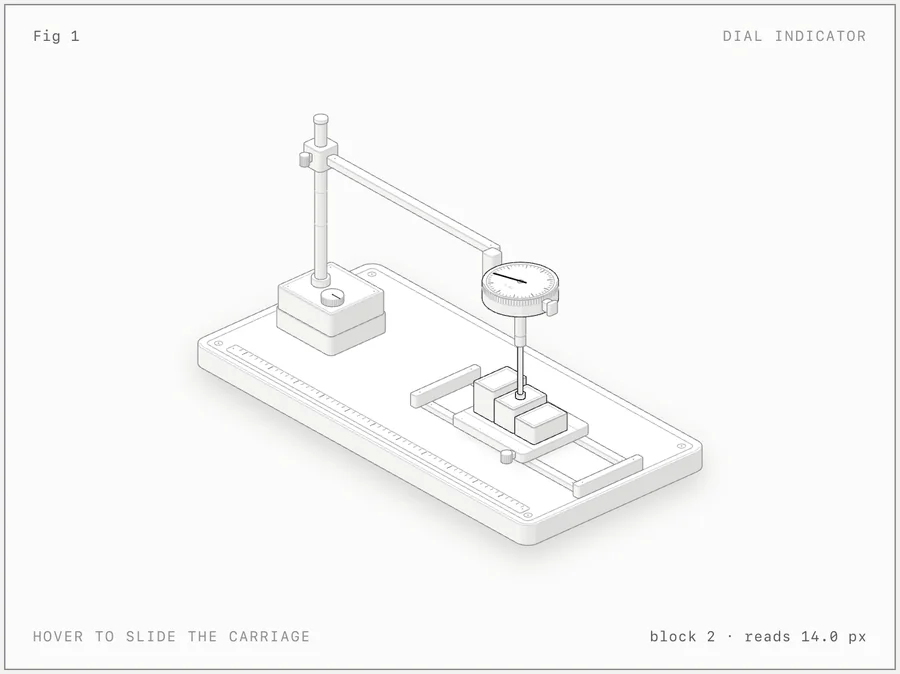

<h1 align="center">Anatomy</h1>

<p align="center"><b>A Claude skill that explains an idea by building it as a real, working object.</b><br>Crafted, interactive isometric figures with many small precise parts, in SVG, WebGL and 3D.</p>

<p align="center">
  <a href="https://code.claude.com/docs/en/skills"></a>
  <a href="https://agentskills.io"></a>
  <a href="LICENSE"></a>
  <a href="#requirements"></a>
  <a href="#requirements"></a>
  <a href="https://github.com/wheresryan22/anatomy/actions/workflows/ci.yml"></a>
</p>

<p align="center">
  <a href="https://skills.wheresryan.sh/anatomy"></a>
  &nbsp;
  <a href="https://github.com/wheresryan22/anatomy/archive/refs/heads/main.zip"></a>
  &nbsp;
  <a href="#install"></a>
</p>

<p align="center">
  <a href="#quick-start">Quick start</a> ·
  <a href="#gallery">Gallery</a> ·
  <a href="#what-it-makes">What it makes</a> ·
  <a href="#install">Install</a> ·
  <a href="#usage">Usage</a> ·
  <a href="#examples">Examples</a> ·
  <a href="#how-it-works">How it works</a> ·
  <a href="#limits">Limits</a>
</p>

<p align="center">
  
</p>

<p align="center"><sub><code>examples/raptor-engine</code>, light theme, firing. The engine and stand are SVG; the plume is a WebGL shader in the same isometric camera.</sub></p>

---

Ask Claude for a figure that explains a technical idea, and Anatomy has it invent a physical thing whose working *is* the concept. A cache key that skips work when nothing changed becomes a pin-tumbler lock that only turns when every pin matches. One GPU context serving many canvases becomes a gantry plotter whose single print head visits 16 wells.

Then Claude builds that thing out of dozens of small, solid, shaded parts, puts it in a framed card with a title, a hint and a live readout, makes it move calmly under the pointer and the keyboard, and checks its own work by zooming in on every joint. Every number the figure shows comes from the same small model that moves its parts.

## Quick start

```sh
npx skills add wheresryan22/anatomy -g -a claude-code
```

Then, in Claude Code:

```text
/anatomy explain how a token bucket rate limiter works, interactive
```

That's it. No API keys and nothing to `npm install`: the kit uses only Node's built-in modules.

## Gallery

<table>
  <tr>
    <td width="50%"></td>
    <td width="50%"></td>
  </tr>
  <tr>
    <td><sub><b>raptor-engine</b>: hover to take it apart into 11 assemblies. An audit proves that no pipe passes through anything, at rest, apart and in every frame between.</sub></td>
    <td><sub><b>ripple-tank</b>: SVG apparatus over two WebGL layers (lamp light and caustics on the paper, reflections in the water) driven by a dispersion and optics model.</sub></td>
  </tr>
  <tr>
    <td></td>
    <td></td>
  </tr>
  <tr>
    <td><sub><b>turning-dial</b>: the 3D mode (beta). About 90 parts are re-projected and re-shaded every frame as you drag the dial.</sub></td>
    <td><sub><b>dial-indicator</b>: the smallest example, about 300 lines. Hover to slide the carriage; the needle reads each block.</sub></td>
  </tr>
</table>

Every screenshot is the light theme of a page in [`examples/`](examples), captured with the skill's own [`scripts/capture.mjs`](scripts/capture.mjs) and [`scripts/drive.mjs`](scripts/drive.mjs). The built pages are committed: open any `.html` in `examples/` to try it.

## What it makes

Three kinds of figure. All three share one kit, one camera and one set of craft rules.

| Kind | What it is | Example |
|---|---|---|
| **SVG** | The core. Solid isometric parts with four-tone shading, painted back to front, in a card with a live readout and eased motion. It ships as a standalone HTML page, a lone `.svg` file with its styles embedded, or React/Next.js components. | `dial-indicator`, `desk-computer`, `arcade-cabinet`, `test-rig` |
| **SVG + WebGL** | For what lines can't draw: fire, exhaust, water, caustics, lamp light, glow, steam. The shader runs in a canvas between a back and a front SVG, in the figure's own isometric camera, so it sits inside the drawing. The SVG still reads without WebGL. | `raptor-engine`, `ripple-tank` |
| **3D** <sup>beta</sup> | Parts that turn in true 3D: a dial or turntable that spins, fingers that flex, a piece that breaks off and falls. The moving parts are re-projected and re-shaded by the kit's own rules every frame; the rest of the figure stays static art. | `turning-dial` |

Each figure is light or dark. Light is the theme the skill designs for first, shaders included.

## Install

Anatomy is a standard [Agent Skill](https://code.claude.com/docs/en/skills): a folder with a `SKILL.md` at its root. This repository is that folder. Pick one way in:

| | Command | Installs to |
|---|---|---|
| **skills CLI**, for you | `npx skills add wheresryan22/anatomy -g -a claude-code` | `~/.claude/skills/anatomy` |
| **skills CLI**, for one project | `npx skills add wheresryan22/anatomy` | `.claude/skills/anatomy` |
| **git**, for you | `git clone https://github.com/wheresryan22/anatomy.git ~/.claude/skills/anatomy` | `~/.claude/skills/anatomy` |
| **git**, for one project | `git clone https://github.com/wheresryan22/anatomy.git .claude/skills/anatomy` | `.claude/skills/anatomy` |
| **Download**, no git | see below | `~/.claude/skills/anatomy` |

<details>
<summary><b>With the skills CLI</b></summary>

<br>

The [`skills`](https://github.com/vercel-labs/skills) CLI finds the `SKILL.md` at the root of this repository and installs it as `anatomy`. By default it installs into the current project and asks which agents to set up. `-g` installs it for your user, and `-a claude-code` sets up Claude Code only.

The CLI copies the whole repository, examples included (about 10 MB). It needs a recent Node.js: version 1.7.1 of the CLI asks for 22.20 or later.

</details>

<details>
<summary><b>With git</b></summary>

<br>

Clone the repository into one of Claude Code's skill folders, so that `SKILL.md` ends up at `<skills folder>/anatomy/SKILL.md`. For a project install, commit `.claude/skills/anatomy` so your team gets it too. To update later, `git pull` inside that folder.

</details>

<details>
<summary><b>Download, without git</b></summary>

<br>

[Download the ZIP](https://github.com/wheresryan22/anatomy/archive/refs/heads/main.zip), unpack it, rename the folder from `anatomy-main` to `anatomy`, and move it into `~/.claude/skills/`.

Or in one line on macOS or Linux:

```sh
mkdir -p ~/.claude/skills/anatomy && curl -L https://github.com/wheresryan22/anatomy/archive/refs/heads/main.tar.gz | tar -xz --strip-components=1 -C ~/.claude/skills/anatomy
```

</details>

Claude Code picks up new skills in a running session. If the `skills` folder itself did not exist when the session started, run `/reload-skills`.

## Usage

Type `/anatomy` and say what the figure should explain:

```text
/anatomy explain how a token bucket rate limiter works, interactive
```

You don't have to name the skill. Claude also loads it when you ask for an isometric illustration, an explanatory figure for docs, a blog post or a landing page, or an interactive explainer.

<details>
<summary><b>More prompts</b>, from the skill's <a href="evals/evals.json">evals</a></summary>

<br>

```text
/anatomy a figure for our Next.js docs on database connection pooling: a pool of 10 connections, requests borrow one and give it back, and when all 10 are busy new requests wait in a queue. A React component plus a static HTML preview, dark theme.
```

```text
/anatomy an isometric SVG explaining how a CDN edge cache works, cache hit vs miss, TTL of 60 s, for a dark landing page. Just the SVG file and a PNG preview.
```

```text
/anatomy a Bunsen burner on a lab bench: opening the air collar turns the lazy yellow flame into a roaring blue cone. WebGL for the flame, one HTML file, dark theme.
```

```text
/anatomy a heat-exchanger espresso machine with the side panel off: boiler, heat-exchanger tube, group head, pump, steam wand and gauge. Show the water flowing when you pull a shot. Standalone HTML, light theme.
```

</details>

Three habits get the best figures:

1. **Name the idea, not the drawing.** Say what it should explain and give the real numbers (sizes, counts, rates, thresholds). Anatomy invents the object; that is most of the work, and it does it better than a description of boxes and arrows.
2. **Or name the object.** If you already know the machine you want (an espresso machine, a Bunsen burner, a lock), say so, and say what should move.
3. **Say where it will live.** A standalone HTML page, a lone SVG file, or a React/Next.js component; light or dark. The build differs for each.

A figure arrives as source you own: a Node build script and the page it writes, or, for React, geometry modules, a server component for the static art and one client component for the motion. The kit comes with it.

## Examples

Each framework-free example has a Node build script that writes standalone pages next to itself. Add `--light` for the light theme.

| Example | What it shows | Build |
|---|---|---|
| [`dial-indicator`](examples/dial-indicator) | A dial gauge on a stand over a carriage of gauge blocks. The smallest example, about 300 lines. | `node examples/dial-indicator/build.mjs` |
| [`desk-computer`](examples/desk-computer) | A 1984-style desk computer with a keyboard you can type on. The typed line appears on a CRT drawn in the plane of the case front, and switching it off collapses the picture to a line and a dot. About 85 solids. | `node examples/desk-computer/build.mjs` |
| [`arcade-cabinet`](examples/arcade-cabinet) | An upright arcade cabinet with its side panel off. Drop a quarter: it rolls down the coin chute past the coin-switch wire into the cash box, a pulse runs along the cable to the board, and the CRT warms up into an attract mode drawn in the plane of the tilted monitor. About 240 solids and 15 cables. | `node examples/arcade-cabinet/build.mjs` |
| [`raptor-engine`](examples/raptor-engine) | A Raptor 2 engine in a test stand. It comes apart into 11 assemblies, and a WebGL plume, shock, splash and steam render between the back and front SVG. The reference for dense pipework, smooth shading, fades and the audit. The build takes a few minutes. | `node examples/raptor-engine/build.mjs` |
| [`ripple-tank`](examples/ripple-tank) | A school ripple tank on tall legs over a paper screen, seen from 44° up. Two WebGL layers are registered to the isometric planes and driven by a pure model in `model.mjs`. | `node examples/ripple-tank/build.mjs` |
| [`test-rig`](examples/test-rig) | A production figure from a React/Next.js site: a glass button on a spring-mounted carriage, a finger probe on a rail, and a dial gauge reading the lean. 53 solids. No build script: copy it into a React app. | none |
| [`spot-plate`](examples/spot-plate) | A second figure from the same site: six pairs of glass drops on a spot plate that run together into one piece of glass as a fan of feeler blades opens. Each pair is drawn from one distance field. No build script: copy it into a React app. | none |
| [`turning-dial`](examples/turning-dial) | The 3D mode: a combination dial that turns in true 3D with a small robot hand on it, a three-hinge finger that lifts, and a pod that breaks off as a free body. `stress.mjs` is a 380-part hand in a cluttered workshop, used to measure performance. | `node examples/turning-dial/build.mjs` |

`node examples/raptor-engine/build.mjs --audit`, `node examples/arcade-cabinet/build.mjs --audit` and `node examples/turning-dial/build.mjs --light --audit` also run the geometry audit. The 3D audit is slow; see [`references/3d.md`](references/3d.md).

## How it works

- **[`SKILL.md`](SKILL.md)** is what Claude reads. It sets the workflow: collect the true numbers first, invent the object, write a parts list, plan the world, build the geometry once with the kit, paint back to front, frame it, make it live, and then verify it like a critic. It also holds the craft rules in short form.
- **[`kit/`](kit)** is the drawing library the figures are built from: the isometric camera, solids and a parts library (`iso-kit`), round parts on any axis (`lathe.mjs`), pipes and cables (`tube.mjs`), the WebGL layer (`gl.mjs`), the 3D runtime (`turn*.mjs`), and React components (`react/`). Apart from React for those components, it has no dependencies.
- **[`references/`](references)** are the long-form guides Claude opens when it needs them: craft, the kit API, motion, React, verification, WebGL, a design walkthrough and the 3D mode.
- **Verification.** [`kit/audit.mjs`](kit/audit.mjs) proves the geometry: nothing passes through anything, every end sits on a mount, and every overlap is drawn in depth order (`node build.mjs --audit`). In headless Chrome, [`scripts/capture.mjs`](scripts/capture.mjs) and [`scripts/drive.mjs`](scripts/drive.mjs) take screenshots, close-ups and slowed-down contact sheets, [`scripts/lines.mjs`](scripts/lines.mjs) fails any line that ends in mid-air, and [`scripts/turn-check.mjs`](scripts/turn-check.mjs) checks 3D figures. The skill tells Claude to read every PNG it makes.

<details>
<summary><b>Repository layout</b></summary>

<br>

```text
anatomy/
├── SKILL.md                  the skill: workflow, setup and craft rules
├── kit/                      the drawing library
│   ├── iso-kit.ts            the core: camera, solids, parts, SVG renderer, card and page, CSS
│   ├── iso-kit.mjs           the same core as plain ESM, for Node build scripts
│   ├── iso.css               the kit's CSS, both themes
│   ├── react/                draw.tsx (server-safe components), live.tsx (client hooks)
│   ├── lathe.mjs             round parts on any axis
│   ├── tube.mjs              pipes, tubes and cables
│   ├── audit.mjs             the geometry audit
│   ├── gl.mjs                the WebGL layer for shaders inside the drawing
│   ├── turn.mjs              the 3D runtime (beta)
│   ├── turn-build.mjs        the 3D builder
│   ├── turn-audit.mjs        the 3D orbit audit
│   └── turn-fixed.mjs, canvas-painter.mjs, gl-shared.mjs
│                             experimental variants, not yet documented or used by the examples
├── references/               long-form guides Claude reads as needed
│   ├── craft.md  kit.md  motion.md  react.md
│   └── verify.md  webgl.md  walkthrough.md  3d.md
├── scripts/                  headless Chrome checks and build helpers
│   ├── capture.mjs           screenshots and close-ups
│   ├── drive.mjs             scripted sessions and contact sheets
│   ├── lines.mjs             the line-end check (with line-ends.mjs)
│   ├── inline-kit.mjs        the kit as source, to inline into a standalone page
│   ├── turn-check.mjs        3D checks in the browser (with turn-fidelity.mjs)
│   └── turn-bench.mjs        3D timing in Node
├── examples/                 eight complete figures, built pages committed
├── evals/evals.json          test prompts and what a good answer contains
└── .github/                  issue forms, PR template, CI, README images
```

</details>

## Requirements

| | Needed for | Notes |
|---|---|---|
| **[Claude Code](https://code.claude.com/docs/en/overview)** | everything | The skill is written for it. |
| **Node.js 20.10+** | builds, kit, checks | Built-in modules only: nothing to `npm install`. The examples were rebuilt byte for byte on Node 20.19 and 22.11. On Node 20 the browser scripts restart themselves with `--experimental-websocket`. |
| **Chrome or Chromium** | the checks | `capture.mjs`, `drive.mjs`, `lines.mjs` and `turn-check.mjs` look in the usual places on macOS, Linux and Windows and in Playwright's cache. Set `CHROME_PATH` for any other binary. They run it headless with WebGL on. |
| **React 18+** | React output only | `kit/react/`, `examples/test-rig/` and `examples/spot-plate/`. |

## Limits

- **It is not a chart library.** There are no axes, series or data plots. Numbers appear as a live readout driven by a model, and as the true sizes and counts of the parts.
- **It draws machines, instruments, tools and furniture.** Not people or exact maps. An idea that has no mechanism to build will come out weaker.
- **It is slow on purpose.** A figure takes a long session: the parts list, the geometry, the audit, and close-ups of every joint in both themes. The Raptor's build takes a few minutes, and a full 3D orbit audit takes 15 to 20 minutes for 30 parts.
- **Shaders need WebGL.** Without it the SVG still reads, and under reduced motion every figure goes still.

> [!NOTE]
> **The 3D mode is beta.** It is proved on its example and one test figure, not yet on a production figure. A small 3D figure runs at 60 fps; the 380-part stress hand measured about 20 fps at 1440 px wide and 13 to 15 fps on a throttled phone profile, on a heavily loaded machine.

## Contributing

Issues and pull requests are welcome. Read [CONTRIBUTING.md](CONTRIBUTING.md) first: it covers building the examples, the checks, and the house rules a change has to keep (among them, no comments in code, and kit changes that leave every existing example byte-identical). Please follow the [Code of Conduct](CODE_OF_CONDUCT.md), and report security problems as described in [SECURITY.md](SECURITY.md).

- [Report a bug](https://github.com/wheresryan22/anatomy/issues/new?template=bug_report.yml)
- [Request a figure](https://github.com/wheresryan22/anatomy/issues/new?template=figure_request.yml)
- [Changelog](CHANGELOG.md)

## License

[MIT](LICENSE) © 2026 Ryan · [@wheresryan22](https://x.com/wheresryan22)

<p align="center"><sub>If Anatomy drew something useful for you, a ⭐ helps other people find it.</sub></p>
