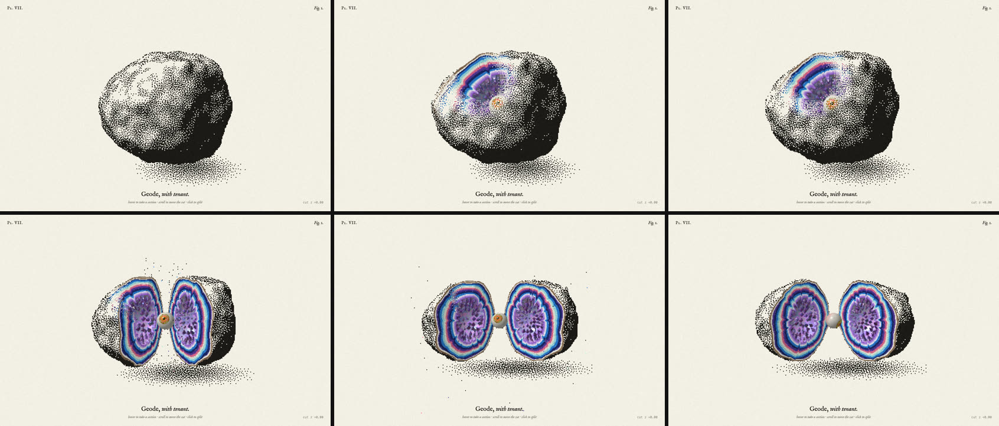

# Dither reveal

| path | what |
|---|---|
| `template/engine.js` | Both modes: layout, Floyd–Steinberg, the veil mask + composite shaders, the filings particle sim + point-sprite shader, pointer handling. Shared: change it here, then run `scripts/sync-engine.sh` |
| `template/index.html` | Page shell: captions, credit line, `window.DITHER` (EDIT markers). Edit per page |
| `scripts/new.sh <dest> <image> [veil\|filings] [prep flags]` | Scaffold a page from any image |
| `scripts/prep-image.py <in> <out.js>` | Cut the subject off a plain background (or keep the rectangle), crop, resize, and embed as a data URI (`window.DITHER_IMAGE`). `uv run` handles its deps |
| `scripts/shot.mjs <dir> <out.png>` | Headless Chrome with the GPU, real mouse events: idle → sweep → parked → tap → +0.5 s → 2.5 s after leaving, tiled into one sheet, plus engine stats and fps. No npm deps (Node 22+, Chrome, ffmpeg) |
| `scripts/sync-engine.sh` | Copy the template engine into every example page that loads it |
| `references/config.md` | Every `window.DITHER` field, the tone formula, how each mode works, and starting values by image type |
| `examples/great-wave/` | Veil mode, full rectangle, Prussian ink on cream (the Met, public domain) |
| `examples/morpho/` | Filings mode with iridescent sheen, cut-out specimen photo (Didier Descouens / MHNT, CC BY-SA 4.0) |
| `examples/geode/` | Standalone, no engine: a raymarched SDF geode as a stippled specimen plate. The lens shows the rock cut at a plane (agate bands, druzy amethyst, an eye that tracks you), scroll moves the cut, click splits it open. The pattern for 3D or procedural subjects |

## How it's built

- **Dither**: Floyd–Steinberg with a serpentine scan over a `cols × rows` grid (`cells` across the short side of the viewport), computed once per resize from the image drawn into an offscreen canvas. Transparent pixels count as paper, so a cut-out subject floats on the page. `invert` flips which end of the tone scale gets ink.
- **Veil**: a quarter-res mask texture ping-pongs `max(prev − dt/linger, stroke)`, where the stroke is a capsule from last frame's pointer position to this one. The composite samples the mask at each cell's centre. Low mask values tint the ink dots with the image colour, and higher values hand off to the full-res image through an 8×8 Bayer threshold, so the edge of the reveal breaks up on the same pixel grid. A tap adds an expanding disc to the mask.
- **Filings**: one CPU particle per ink cell (about 10–20k), stored in typed arrays, with three states: home, riding, returning. The magnet catches filings with probability `(1 − d/reach)²`, packs them into a Vogel spiral with a spiky rim and motion lag, lets each go after 2–4.5 s, and a damped spring brings it home. The image shows through blocks whose filings are away (the same Bayer handoff). Filings are point sprites: a square at home, a thin stroke along the field or their velocity when moving.
- **Why two dithers**: error diffusion suits a still image. For anything that moves (the geode rotates), per-frame Floyd–Steinberg crawls and flickers, so the geode uses a void-and-cluster blue-noise threshold, which looks almost the same and stays still.

## Workflow

1. **Get the image.** Best: a subject on a plain background (specimens, products, renders) or a strong flat artwork. Busy photos work with `--cutout none`, but the dither reads as texture, not shape. For a screen recording of a reference effect, pull frames first (`ffmpeg -i ref.mp4 -vf fps=2 f_%02d.png`) and read them to settle the mode, dot size, radius and linger. If the recording's own image is needed and there's no source, frames where the cursor revealed each region can be stitched: per pixel, take the frames with the lowest local high-frequency energy.
2. **Pick the mode.** Veil for a calm, editorial reveal. Filings for something tactile and playful. Veil + `invert` for chrome, neon and glossy renders.
3. **Scaffold**: `~/.claude/skills/dither-reveal/scripts/new.sh <dest> <image> [veil|filings]`, adding `--cutout none` for paintings, prints and full-bleed photos.
4. **Tune** in `<dest>/index.html`: `contrast` / `brightness` first (the veil should read as the subject with open paper around it, not a grey slab), then `cells`, then the mode's block. See `references/config.md` for starting values.
5. **Contact sheet**: `node …/scripts/shot.mjs <dest> /tmp/s.png`, Read it, adjust, repeat. Check that the idle frame shows no reveal, the healed frame matches idle, and fps holds around 60.
6. **Captions and credit.** Keep a credit line for any image whose licence asks for one. Hand over the path; it opens from file://.

## Rules

- Images go in as data URIs (`image.js`), never as `file://` paths. WebGL and `getImageData` reject file-origin images, and you'd get a blank canvas and a security error.
- Don't drive animation from a raw rAF delta. Clamp it on both sides (`min(0.033, max(0.001, …))`): the first rAF timestamp can predate the `performance.now()` you started from, and a negative `dt` turns decay into growth. That's how a page ends up starting fully revealed.
- `invert: true` needs alpha. Without a cut-out, the white background becomes solid ink.
- Keep the image rect a whole number of cells (the engine snaps it) so the dither grid, the Bayer handoff and the filing sprites all land on the same pixels.
- One subject per page. The veil radius and magnet reach are sized to the image, and two images would fight over them.

## Known limits

- Floyd–Steinberg is recomputed on resize, so a live resize flashes a fresh dither. Filings also reset.
- Filings mode is CPU-bound: about 16k filings hold 60 fps on an M-series laptop at 2× DPR. Very high `cells` on a 4K screen, or low-end phones, may need `cells` lowered.
- Touch: dragging acts as hover or the magnet, and a tap bursts or flips polarity. There's no hover on touch, so the veil only opens while a finger is down.
- The geode example is its own raymarcher. Reuse its structure (ray A = the veil's exterior, ray B = the revealed state, only where the mask is non-zero), not the engine.
