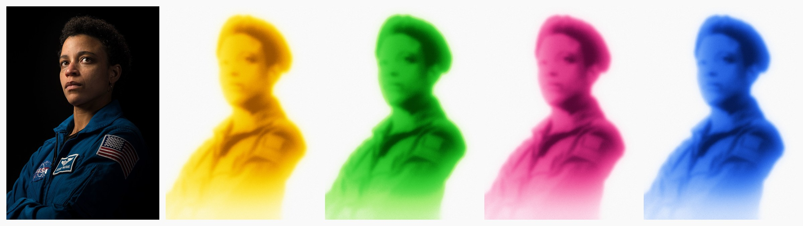
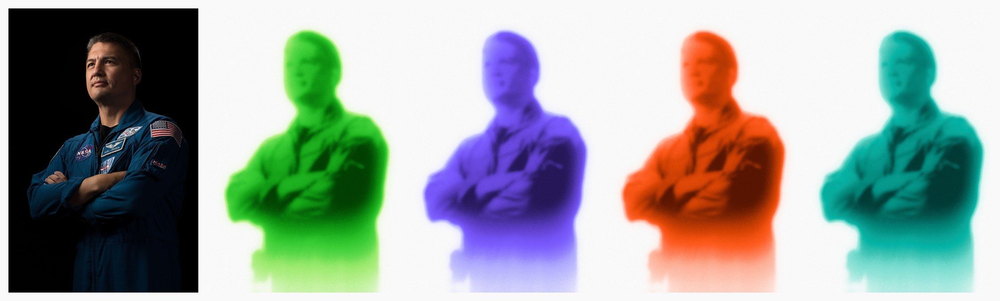

# Frosted figure

| path | what |
|---|---|
| `template/frost.js` | The effect, no dependencies: colour-key cutout, density, frosting blurs, palettes, the any-hex palette builder. `frostDensity()` is the slow part, `frostColour()` re-colours it cheaply |
| `template/index.html` | The page. MediaPipe person cutout, `window.runFrost(cfg)` for the renderer, and a by-hand mode: drop a photo, click palettes, pick any colour, save PNG |
| `scripts/render.mjs <photo> [out] [--palette …]` | Headless Chrome render to PNG(s). Node 22+, no npm deps. Caches MediaPipe in `~/.cache/frosted-figure` on first run (~50 MB), offline after that |
| `scripts/sheet.py <out> <imgs…>` | Contact sheet for comparing palettes or tuning variants (`uv run`) |
| `references/tuning.md` | Every option, what each photo type needs, and the failure modes with their fixes |
| `examples/` | Two public-domain NASA portraits (dark subjects on black: the hard case for a colour key) |

## How it's built

1. **Cut out the person.** MediaPipe `selfie_multiclass_256x256` runs in the page (WASM, CPU) and returns per-class confidences. Person = 1 − background, stretched (`smoothstep(0.3, 0.7)`) because the model leaves a ~10 % floor over the backdrop that would tint the paper. Hair + face-skin give a head mask, used to size the blur. Fallback, or `--cutout key`: fit the backdrop as a smooth colour field (RANSAC plane on the border, then a quadratic on its inliers, so a jacket running off-frame can't drag the fit), key by distance from it, close speckle, flood-fill holes.
2. **Density** = `mask × (base + shadow × darkness + depth × inside²)`. *Darkness* is the photo's luminance auto-levelled on the person alone (5th–85th percentile), so a navy suit on black and a bleached head on pale blue both use the whole ladder. *Inside* is the mask blurred wide: deep in the body is denser, the rim is light — that's what makes it read as glass, not a cut-out.
3. **Frost**: two gaussian blurs of the density (three box passes each), mixed 65/35. The near sigma scales with the **head**, not the frame (0.021 × head width, clamped 0.008–0.02): a face that's a quarter of the frame needs less blur than a close-up to stay a face.
4. **Fade** density toward the bottom so the figure dissolves into the paper.
5. **Colour**: density → an 11-stop gradient map (paper white → pale rim → saturated mid → deep core), plus density grain and luminance grain. Custom colours are built in OKLab: the hex lands on the 0.54 stop and the green ladder's lightness and chroma shape is transplanted to its hue, gamut-clipped.

## Workflow

1. **Get the photo.** Any photo of a person works with the ML cutout. One clear main subject, head visible. Group shots get merged into one blob.
2. **Render**: `node ~/.claude/skills/frosted-figure/scripts/render.mjs <photo> <out-prefix> --palette green` (or `yellow,green,pink,blue`, or `#7b5cff`). It prints the cutout used and what the `auto` options resolved to.
3. **Look at it next to the source**: `uv run …/scripts/sheet.py /tmp/s.png <photo> <out>-green.png`, then Read it. Check: the face still reads as a face; the paper is clean (no tint, no halo blocks); the rim is pale and the core deep, not one flat slab.
4. **Tune only what's off** (`references/tuning.md`): render 2–3 variants side by side and pick, passing the resolved values as a starting point (`--blurNear 0.012 --shadeHi 0.3`). Add `--mask` to see the cutout when edges look wrong.
5. **Colourways**: one run renders every palette in `--palette` from the same cutout. Hand over the PNG paths (and a sheet if there are several).

For a quick interactive pass: serve `template/` (`python3 -m http.server -d template`) and open it, or open `index.html` directly and drop a photo — dropped files are read as data URLs, so it works from `file://` too.

## Rules

- Never load the photo into the canvas from a `file://` URL: the canvas is tainted and `getImageData` throws. The renderer serves it over `http://127.0.0.1`; the by-hand page reads dropped files as data URLs.
- Keep sigmas as fractions of width. Absolute pixel blurs make the look change with resolution.
- Don't push a true dark yellow: it turns olive. The `yellow` and `gold` ladders stop at amber in the shadows; for custom yellows and oranges, prefer `gold`/`yellow` or accept browner darks.
- Re-colour with `frostColour()` on the cached density; don't re-run the cutout per palette.
- Credit the source photo when it asks for it. The bundled examples are public-domain NASA portraits; renders of other people's photos inherit those photos' rights.

## Known limits

- The ML cutout downloads the MediaPipe runtime and model on first use (jsDelivr + Google Storage). Offline on a first run, `--cutout auto` falls back to the colour key, which only works on plain or smoothly graded backdrops.
- `selfie_multiclass` is trained on people. Statues, mannequins and cartoons segment unreliably; use `--cutout key` on a plain backdrop instead.
- Large dark clothing dominates: a black jacket filling half the frame becomes the deepest, biggest shape. See "jacket mass" in `references/tuning.md`.
- Processing is CPU JavaScript at `--size 1600` (about 1–3 s). `--size 3000` works but takes a few times longer.
