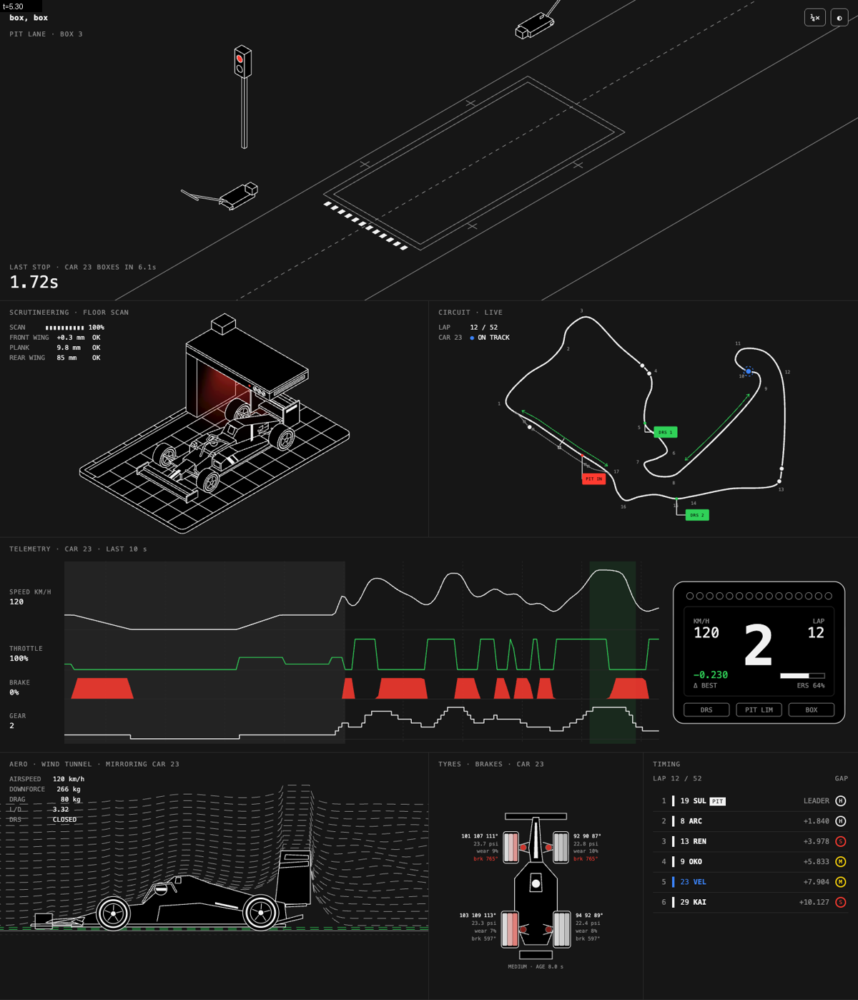
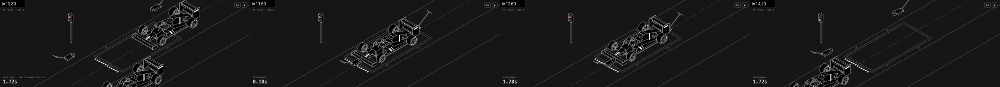
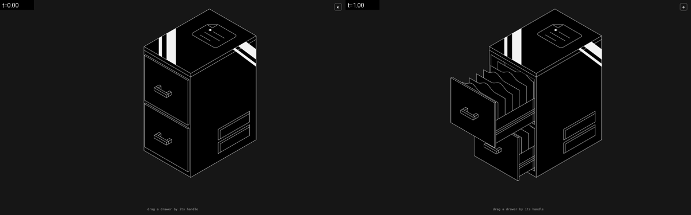

# Isometric SVG

| path | what |
|---|---|
| `template/iso.js` | The engine: projection `P`, `poly`, `line`, `tube`, `box`, `extrude`, `cylinderU`, `ring`, `hull`, `roundRect`, `slab`, `clipD`, timeline helpers. See `references/primitives.md` |
| `template/index.html` | Starter scene: plate, crate with a sliding lid, a barrel rolling out and back, glare band, accent, `state(t)` → `frame(state)`, `window.freeze(t)`, light/dark tokens. Copy it and the engine side by side |
| `examples/filing-cabinet.html` | Standalone. Drag a drawer by its handle (spring follow, rubber-band stops, throw with friction, click to toggle), hanging folders with wavy tabs that sway with acceleration, back part of the drawer clipped to the opening |
| `examples/pit-wall.html` | Standalone, seven panels on one race clock (see below). The reference for anything bigger than one object |
| `scripts/shoot.py` | `uv run scripts/shoot.py page.html --times 0:5:0.25 --selector svg --out sheet.png` — freezes, screenshots, tiles with timestamps, fails on page/console errors, `--check '<js>'` prints a scripted check. Uses installed Chrome |
| `references/primitives.md` | Axes, every primitive, painter's order rules, clipping through openings, glare/accents, theming |
| `references/verification.md` | The checks that caught real bugs here: contact sheets, collision/overlap scans, streamline crossings, monotonic motion, range asserts, loop seams |

## The look

- Faces filled with `--ink` (black), every edge a 1.15px `--line` stroke with `vector-effect: non-scaling-stroke`, so lines stay hairline at any zoom. Light theme swaps the two.
- Depth comes from occlusion and structure, not shading: no gradients on faces. Add form with **inset lines** (a lip 3 units below a top edge, a panel inset 2 units), **solid white glare bands** clipped to a face (two bands, one thin and one thick, at a diagonal), and small details on the faces the viewer sees (handles as boxes, vents as inset slots, sensor rings, a document icon on a lid).
- Colour is information only: a red stop light, green DRS, a blue "ours" marker, a red glow. One or two accents per scene.
- Glows and light are the one exception to flat fills: a gradient-filled polygon **blurred** with `feGaussianBlur` (a plain gradient shows its polygon edges as hard lines), drawn behind the object, plus a faint copy with `mix-blend-mode: screen` over it.
- Type: small monospace caps with letter-spacing for tags and readouts; tabular numbers.

## Workflow

1. **Reference first.** For a video, pull a contact sheet (`ffmpeg -i ref.mp4 -vf "fps=2,scale=480:-1,tile=4x4" s%02d.png`) and crops of the object at a few moments (`crop=` on the object at 3× scale). Note which parts move, along which world axis, and what the interaction is (drag? hover? timed?). Copy the motion, not just the still.
2. **Pick axes.** The long axis of anything that slides or drives goes along `d` (moves ↗/↙ on screen) so its +u flank and −d front face the viewer. Write dimensions as constants.
3. **Block out** with `box` and `extrude` only, one screenshot, then fix proportions before adding detail.
4. **Painter's order**: write the draw list back to front by hand (far side → body → near side → things in front). Fixed-orientation objects never need depth sorting. Where one object can be on either side of another over time, switch its draw slot with a condition (the parked jack draws before the car, the working jack after).
5. **Animate as a pure function**: `state(t)` returns every moving value; the frame is `frame(state(t))`. Easing windows with `seg(t, [a, b])`. Interactive parts keep a little physics state (spring toward a target, friction, stops) but still render from state.
6. **Verify** with `scripts/shoot.py` over the whole loop, zoom strips of anything that looks off, and scripted checks (`references/verification.md`). Then look at it in a real browser.

## The pit wall example

One `LAP` clock drives everything; car 23 is "ours".

- **Pit lane · box 3** — the car drives in, both jacks swing in from the same side, the car lifts, four corners swap tyres with slightly different crew timing, drops, the light goes green, the jacks swing out together and the car leaves. Rivals pitting to other boxes drive past in the fast lane and fade at the edges. A stationary timer and a countdown to the next stop.
- **Scrutineering** — the same car model on a rounded gridded plate; a pillar + slab gantry sweeps along a rail with a blurred red light fan; a readout ticks off parts as the scan passes.
- **Circuit** — a centripetal Catmull–Rom track with numbered corners, a pit lane offset from the main straight, DRS arrows, flag callouts, cars moving on a curvature-based time profile (slow in bends), each rival in its own box.
- **Telemetry** — speed, throttle, brake, gear over the last 10 s from car 23's position on the lap, DRS and pit bands, and a steering-wheel display (rev LEDs, gear, speed, Δ, ERS, DRS / PIT LIM / BOX).
- **Wind tunnel** — side view; streamlines are `sqrt(H0² + h(x)²)` over a blurred height envelope of the car (never cross), squeezed under the floor, a coherent wake behind the rear wing, the DRS flap pivots open in DRS zones, downforce and drag ∝ v².
- **Tyres** — top-down car, three-zone surface temps (cold grey → white → red), pressure, wear, brake discs that glow after heavy braking; fresh cold tyres right after the stop.
- **Timing** — ordered by race time (not distance round the lap, which reshuffles the order at every pit stop), gaps, compound, PIT/BOX tags, a ▲ on a gain; rows slide with a CSS transform.

Offscreen panels are skipped with an `IntersectionObserver`, so a full-page screenshot shows stale values for panels below the fold unless you call their frame functions first (the shoot command for `assets/pit-wall.png` does).

## Lessons (each cost a round trip with the user)

- **Near-miss alignment reads as a bug.** A pillar 2 units wider and 6 units behind a slab drew a jog at the corner. Make parts that touch share exact edges (use the same constant), or offset them by a clearly deliberate amount.
- **Fix the twin.** After moving the front jack out of the car's path, the rear jack was still sitting in the lane the car drives in through. Check every object on the same path, not just the one reported.
- **Anything in a lane must leave it**, or the moving object drives through it. Park props beside the path and swing them in.
- **Loop seams**: `state(0)` must equal `state(LOOP)` for everything visible, or objects teleport on repeat. Ping-pong motion or move things back during a rest phase.
- **Fractions round a loop must wrap.** `TAU_A − TAU_B` was negative because the pit exit sits just before the lap's start index, and car 23 crept backwards along 9% of a straight for three rounds of edits. Normalise with `((x % 1) + 1) % 1` and assert the range.
- **Noisy inputs make noisy animation**: curvature from spline samples saw-tooths at the joins; smooth by arc length (gaussian) before using it for speed.
- **Timing systems**: rank by race time, give each car a separate "where am I on the road" offset, and stagger pit windows, or the whole field pits at once.
- **Screenshots lie in two ways**: CSS transitions caught mid-slide look like overlaps (wait for the transition), and offscreen panels skipped by an observer look stale.
