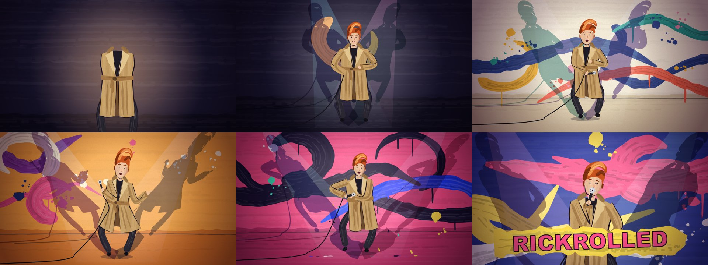
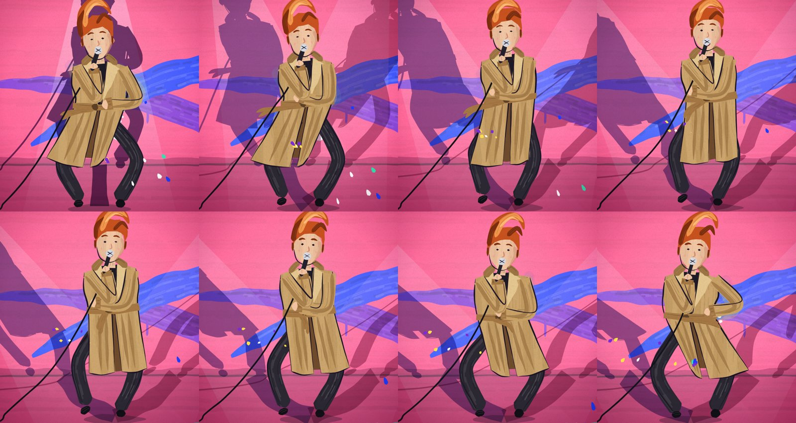

# Painted dance

| path | what |
|---|---|
| `examples/crooner.html` | complete 60 s film: a trench-coated 80s crooner doing the side-to-side sway, the counter-swinging arms, a spin, and three stop-hits. The reference to copy from |
| `references/recipe.md` | how each layer is built and which block to replace to re-skin it (performer, moves, palette, score) |
| `scripts/stills.sh` | renders `?t=` stills, a contact sheet and a 12 fps motion strip with headless Chrome |
| `scripts/sync.py` | `uv run scripts/sync.py track.mp3 [start_s]` → the exact `bpm` and `offset` for a user-supplied track (kick-grid search) |

## What makes the style

1. **Every mark is a brush.** `brush()` builds a Catmull-Rom centreline, a tapered ribbon whose width wobbles with value noise, then 2–12 bristle streaks in lighter and darker tints, with dry-brush gaps that increase toward the end of the stroke. `blob()` is a rough-cut polygon with brush texture clipped inside it. Nothing is a vector primitive.
2. **Boil on twos.** Stroke noise is seeded by `seed + floor(t·12)·131`. The figure is redrawn 12 times a second, while its motion runs at the display rate. Wall paint is passed `still` so the paper stays calm while the performer is alive.
3. **The dance is a function of the beat.** Every move is `pose(b)` where `b = t / BEAT`: hip x from a snappy sine (`sign·|sin|^0.65`), knee dip `cos⁴(πb)` on every beat, hands placed as targets in torso space and solved with two-bone IK. Section blends last one beat, stop-hits snap in 0.2 beats with `easeOutBack`. No simulation means any frame can be sought, which is what makes `?t=` stills and chunked audio possible.
4. **Secondary motion = the past pose.** Coat hems are offset by `(hip(t−0.13) − hip(t))·1.9` and belt ends use `t−0.2`. A cable is a whip: point *k* sits where the mic was at `t − 0.035k`, pulled toward its floor anchor. Hair uses the nod velocity. Everything that trails stays exaggerated and stays seekable.
5. **Shadows perform too.** Two lights swing in half time (`sw(πb/2)`). The figure is redrawn flat into an offscreen canvas, skewed by the light's offset (`c = −dx/1050`), and multiplied onto the wall in two colours, so the shadows swing further than the dancer.
6. **The wall is painted in time.** Each section wipes a new ground colour across in six staggered bands over 1.25 beats. A big stroke (a wave or a loop) lands on every bar with `easeOut` reveal, drips grow afterwards, splats land on snares, and paint drops fly off the coat hem on chorus kicks.
7. **The camera breathes with the kick** (`1 + 0.013·e^(−7·frac(b))`), pushes in through the pre-chorus and punches in on the stop-hits and the final wink.

## Workflow

1. **Decide the performer and the move vocabulary.** Write 3–5 moves as sentences with counts, e.g. "hips step R on 1, L on 2; forearms pump in counterpoint; mic hand to mouth on bars 1–2 of each 4". Map them to sections (intro/verse/pre/chorus/finale). A famous dance should read from its silhouette alone, so exaggerate the signature beat.
2. **Draw your own performer.** Replace `drawFigure/drawHead/drawArm` (see `references/recipe.md`). Keep the layering order (back cloth → legs → torso → front cloth → head → far arm → prop → near arm) and the `fig: 1` flag on every mark so the paint-in intro works. For a real person, paint a loose homage built from costume, hair and posture, not a portrait. Never recreate a copyrighted cartoon or game character; invent an original one.
3. **Write the score.** Compose an **original** melody and progression in `MEL` / `PROG`. Don't transcribe a real song's melody, riff or lyrics. The synth voices (kick, gated snare, clap, octave bass, brass stabs, FM bell, vibrato lead, pad, riser, toms) cover most dance-pop. The lead-note list also drives the mouth.
4. **Keep sections on the bar grid.** At `BPM = 112` 28 bars is exactly 60 s. Section starts in beats are shared by `MOVES`, `SECT` (palettes/wipes), the camera and the score, so change them together.
5. **Check stills, then motion, then sound.** Run `scripts/stills.sh <file.html>` for the contact sheet and strip. Look for a readable silhouette at thumbnail size, planted feet, no IK pops, and hems trailing in the right direction. Then play it in a browser. Frame cost should stay under ~5 ms, and each score chunk renders in about 1 s.
6. **User-supplied music.** The page plays any file dropped on the canvas or passed as `?audio=path` with `&bpm=&offset=`, where `offset` is the time of bar 1 in the file. Get both from `scripts/sync.py`, not from a quick tempo estimate: 112.35 vs the true 113.64 drifts by a whole beat within a minute. Serve `?audio=` over localhost, because `fetch` of `file://` is blocked, and copy the track next to the page instead of symlinking out of `~/Downloads`, which macOS privacy protection hides from the server. Only use audio the user already has. Don't download commercial recordings for them or commit such files to a repo.

## Gotchas

- `shade()` takes hex only. Use the `fill` option for a pre-mixed ribbon colour.
- A full-length `OfflineAudioContext` with thousands of notes is slow (≈55 s for 60 s of audio) because finished nodes linger. Render 4-bar chunks, one context each, and schedule each buffer at `t0 + chunk.at` as it finishes.
- Snare gating uses one shared convolver whose output gain opens for 0.25 s per hit. Don't route rolls through it, or the automation overlaps.
- Put `?t=` rendering behind a URL flag so headless Chrome can screenshot frames without an audio gesture.
- A spin in 2D is `scale(cos(2π·ease(u)), 1)` about the hips with `|scale| ≥ 0.12`, and the coat flares while it's thin. It reads as a turn at speed.
