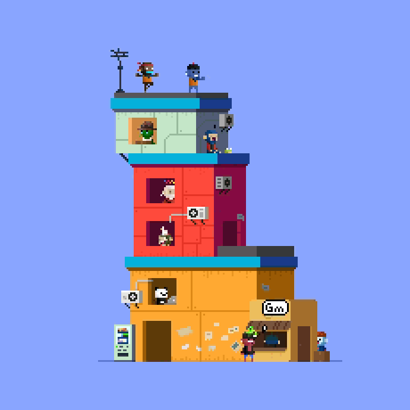

# Pixel rebuild

A clip goes in. Out comes a folder with `index.html` + `data.js` that replays it exactly: the tower above averages 0.26 clearly wrong pixels per frame out of 52,900. The art comes from the source. The page is a replay of its timeline, not procedural characters. The art belongs to whoever drew it, so credit them and ask before posting a rebuild publicly.

| path | what |
|---|---|
| `scripts/extract.py <clip> --out <dir>` | The whole pipeline: grid → frames → layers → palette → `data.js`. Copies the player in if `<dir>/index.html` is missing (it never overwrites one). `uv run` handles deps; needs ffmpeg |
| `scripts/check.py <dir> [--gif out.gif] [--gif-scale 3]` | Opens the page in installed Chrome (Playwright `channel="chrome"`), compares every frame with the source, times real playback, reports page errors; exit 0 = pass. `--gif` writes the loop with per-frame hold times |
| `template/index.html` | The player. Reads `window.PIXEL` from `data.js`; no build, works from `file://` |

## Workflow

1. **Look at the clip first.** Run `ffmpeg -i clip.mp4 -vf fps=2,scale=360:-1,tile=4x4 sheet_%02d.png` and Read the sheets. Settle whether the whole frame is the art. A flat margin is fine; captions, UI chrome, watermarks or a phone frame need `--crop X,Y,W,H`.
2. **Extract**: `uv run ~/.claude/skills/pixel-rebuild/scripts/extract.py clip.mp4 --out <dir> [--audio] [--title "Name"]`. Read the three log lines that matter (below).
3. **Look at `<dir>/.check/orig-vs-rebuild_*.png`**: left is the source sampled on the art grid, right is the rebuild. Frame 0, the middle frame and the worst frame are always there.
4. **Verify in Chrome**: `uv run …/scripts/check.py <dir>`. Pass looks like: mean under ~1 clearly-wrong px per frame, playback within a few frames of expected, no page errors.
5. **Hand over** `open <dir>/index.html`. Controls: space pause, ← → step a frame, `m` sound (only shown when there is audio), `?f=42` opens paused on frame 42, `window.pixel.seek(n)` from the console. Add `--gif` to step 4 if they want something to post.

## Reading the log

- `grid: 3.1310 x 3.1308 … -> art 230x230 (lock 0.39/0.45)`: the art size should look plausible (most pixel art is 120–480 px across). If lock is under ~0.15, the grid is a guess; pass `--scale` (video px per art px) or `--size WxH`. A padded or offset clip can add one extra backdrop row or column, which is harmless.
- `154 distinct frames, 15.50 s; … loops cleanly`: repeats are merged into hold times, so a 60 fps screen recording of 10 fps art gives the art's frames. If it says `visible jump at the loop`, the source isn't a seamless loop. That's not a bug.
- `clearly wrong (>120) mean 0.3 max 4 (frame 55)`: rebuilt from the encoded data and compared with the source. If the mean is above ~1, or the max is big on one frame, open that frame's check image. "Slightly off (>50)" is mostly compression noise in the source that the rebuild has cleaned away.

## Knobs

| flag / constant | default | when to touch it |
|---|---|---|
| `--crop X,Y,W,H` | whole frame | anything in the frame that isn't the art |
| `--scale S` / `--size WxH` | auto | weak grid lock; smoothed (bilinear) upscales; very small art |
| `--fps F` | from the file | a clip with a bogus frame rate; variable-delay GIFs (sample at 50–100 to catch every delay) |
| `--lo` / `--hi` | 30 / 90 | ghosts left behind when a sprite leaves (lower `--lo`); speckle sprites from heavy compression (raise `--hi`) |
| `--audio` | off | copies the soundtrack to `audio.m4a`; the player keeps it within 0.15 s of the picture |
| `PAL_D` in extract.py | 24 | colours closer than this share a palette entry |
| cel match in `cel_dist` | mean < 38, ≤ 1% of pixels > 110 | two poses merged into one (tighten) or noise making hundreds of near-identical cels (loosen) |

## How it works

- **Grid**: the summed gradient across every column/row boundary gives an edge signal. Its Fourier coefficient peaks at the art's pixel period, and the phase gives the offset. With a whole-number scale, p/2 and p/3 tie with p, so the search climbs to the largest multiple that keeps the score (wrong multiples of the true period cancel out).
- **Sampling**: each art pixel averages only the video pixels well inside it, skipping the blended borders. Frames with no pixel changed by more than 90 fold into the previous frame's hold time. A last frame that equals the first is dropped.
- **Background**: the per-pixel median over time. Anything present more than half the time (a dancer who never leaves) lands in the background, and the sprites paint over it, so it's still exact.
- **Sprites**: a pixel counts as changed if it differs from the background by more than `--hi`, or by more than `--lo` while touching one that does (hysteresis). Shapes are closed and hole-filled, then grouped into blobs. Blobs dedupe into cels by exact shape (translation-free), and each cel is the median of all its repeats, which cancels the source's compression noise.
- **Palette**: seeded from the clean background first, then colours only sprites use, with each seed being its bin's mode (the true colour in pixel art). One character per palette index, space = transparent, and the background run-length encoded as `<ch>~<n>.`.
- **Player**: a `Uint32Array` over one `ImageData`: copy the background, stamp the frame's cels, `putImageData`, CSS-scaled by a whole number of device pixels with `image-rendering: pixelated`.

`data.js` sets `window.PIXEL = {title, w, h, durs[ms], backdrop, palette[hex], bg, cels:[[w,h,chars]], frames:[[[cel,x,y],…]], audio, grid}`. To turn the replay into something interactive (named actors, clicks, new paths), group each frame's placements by position into characters and drive them from code. The cels are the sprite sheet.

## Traps already hit

- **Palette cap collapsed real colours.** A 64-entry palette filled up with compression blends and folded the mint wall's tile lines into tan. Now the background seeds the palette first, the alphabet has 614 slots, and seeds are modes, not means.
- **Dark-on-dark outlines vanished.** A plain threshold plus a speckle filter dropped the 1–2 px dark-green outline of a character leaving a navy window, leaving a ghost. Hysteresis plus hole-filling fixed it.
- **A small prop merged into a big sprite.** A crate pushed into a window matched the "empty window" cel because the mean colour distance over the whole window stayed low. Matching now also rejects if more than 1% of pixels differ strongly.
- **Half-period grid.** An exact 3x GIF was detected at 1.5 px per art pixel and rebuilt at 2x size. Fixed by climbing to the multiple, as above.
- **9.99999 fps.** The mp4 reported a rate just under 10 and a frame went missing. `r_frame_rate` comes first, and near-integers snap.
- **Headless `--screenshot` never returns** on a page that runs a `requestAnimationFrame` loop. Use Playwright (check.py) and step with `pixel.seek`.
- **GIF's 256 colours.** Frames can hold ~280 colours. Pillow's quantizer moved one colour by 93 and a top-256-by-count cut by 83. check.py instead merges the closest pair until 256 remain (worst shift 42).
- **zsh doesn't word-split `$var`**, so `set -- $v` in a test loop left `$2` empty and `rm -rf "$dir/$2"` deleted the whole folder. Write test commands out explicitly.

## Limits

- It's a replay. The characters don't react or vary unless you build that on top of `data.js`.
- The static-background assumption breaks with camera pans, zooms, screen shake or parallax. Crop to a static part, or expect huge data.
- Smoothed upscales, heavy compression or chroma-subsampled 1-px details give noisier cels and more colours. The check numbers tell you how much.
- Long or busy clips make `data.js` large (the 15.5 s tower is 195 KB; anything past a couple of thousand distinct frames gets a warning).
