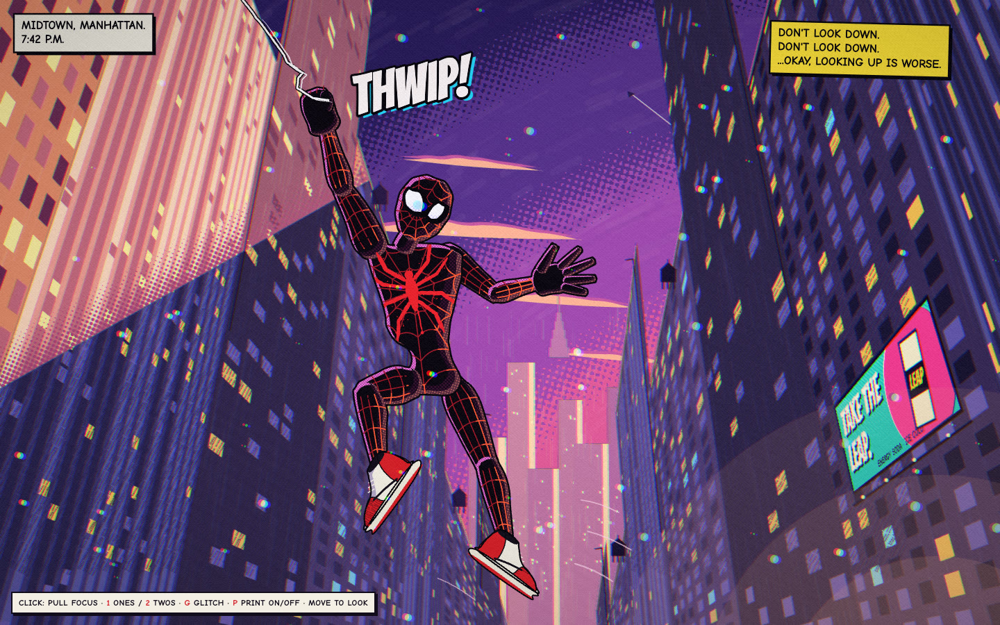

# Spider-Verse look



The film's idea in one line: **"every frame is an illustration"** (Phil Lord). The artists replaced every CG default with something from comic printing: dots instead of gradients, misprinted plates instead of lens blur, drawings on twos instead of motion blur, ink lines drawn over the forms. This skill does the same thing in the browser, **as a drawing**. Paint it; don't build a 3D scene and filter it. The first version of the example was rendered 3D, and it looked like a wireframe mannequin in a CG city.

| path | what |
|---|---|
| `references/style-bible.md` | **Read first.** The substitution table (CG default → Spider-Verse replacement), line, colour and light, shape, camera, texture, motion, lettering, reduction, and a pre-ship checklist, all attributed to page |
| `references/characters.md` | Every character: heads tall, primitive shape, palette hex, render rule (Miles' "baby deer" build and magenta dot rim, Gwen's lavender rim, Noir's hatching, Kingpin's void) |
| `references/environments.md` | Every location: NYC by day, dusk and night, Brooklyn, Visions Academy, subway, Collider, Alchemax, forest, hideout, Queens, Kingpin's palace |
| `references/fx.md` | Focus, speed without blur, spider-sense, Venom Strike, invisibility, glitch, quakes, portal, glows, webs, SFX lettering |
| `references/painting-kit.md` | The `svpaint.js` API, how the example is built step by step, how to draw a figure that isn't a mannequin, and the traps already hit |
| `references/production.md` | Origin, people, how hard it was, story beats, the best quotes |
| `references/book/*.md` | The raw extraction, one file per 35 pages: attributed text insights, page-by-page visual notes with sampled hex, 15 code recipes each, best quotes |
| `references/video-making-of.md` | Insights from "Making Spider-Verse Was Absolute Chaos" (PM. Films) with timestamps |
| `engine/svpaint.js` | The painting kit. Classic script, no deps, opens from `file://` |
| `examples/dont-look-down/` | The finished painting (`index.html` + `svpaint.js`) |
| `scripts/shot.mjs`, `scripts/serve.mjs` | Headless-Chrome screenshots with JS run between frames; static server |

## Workflow

1. **Pick the beat, then the rules.** Who is in it, where, what light. Read that character's and location's entries in `characters.md` and `environments.md`. Pick one dominant hue from the colour-script rule (yellow = home, pink = Miles' own spaces, blue-violet = night hero work, green = danger, white = sterile, orange-gold = catharsis) and decide which region of the frame you're exposing for.
2. **Start from the example.** `cp -r examples/dont-look-down <dest>` and replace sections. Keep the layer stack (sky, far, walls, hero, foreground, lettering), the fixed artboard (1600×1000) and the `art()` transform.
3. **Construct, then paint the world.** Put vanishing points outside the frame and build walls from lines through them (`P.meet`, `P.homography`). Paint flat, then texture (`P.dryBrush` along the construction lines), then windows off-grid ("broken models"), then hatching in the shadows and **halftone dots at the light's terminator**. The sky is a `P.screenGradient`, never a smooth ramp. Reduce: "how far we could reduce the world" (O'Keefe).
4. **Draw the character from joints.** 2D joints for the pose, a clear line of action, `P.limb` contours with asymmetric muscle profiles, big hands and feet for Miles. Ink each mass once (`chain()`), then add creases where forms fold. Light every part with `P.toon`: base shadow, a hard rim band on the rim side (magenta for Miles) with white dots, a mid band printed as dots, a lit crescent. Draw the suit's lines after the light and warm them where lit. Use the character's own style, never a unified one.
5. **Letter it.** A caption box (hand-lettered caps), an SFX that sits in the world (offset colour plate, black outline, tilted), speech balloons as staging. The print layer never misregisters.
6. **Print pass.** Misregistration by depth for focus (background 1–2 px, foreground more, and a big offset only on a focus pull), grain reseeded on twos, a light vignette, glitch on demand. Characters draw on twos; the camera and parallax ease on ones.
7. **Verify by looking.**
   ```bash
   node ~/.claude/skills/spider-verse-look/scripts/shot.mjs <dest> /tmp/a.png
   SIZE=1440x900 FULL=1 COLS=2 node …/shot.mjs <dest> /tmp/b.png '' 'scene.focus(1)' 'scene.glitch()' 'scene.S.print=false'
   SIZE=390x844 DPR=2 node …/shot.mjs <dest> /tmp/phone.png
   ```
   Read the PNGs. Crop the figure (`ffmpeg -i a.png -vf crop=w:h:x:y c.png`) and judge the drawing up close, then run the style-bible checklist.

## The rules that matter most

- **No smooth gradients anywhere.** Flat bands with dots, hatching or comb-edged steps between them. Skin gets the same screen tones as the sets.
- **Focus = misregistered plates, never blur. Speed = crisp copies and streaks, never blur.**
- **Deep graphic darks; expose for one region**; light bleeds in from a frame edge.
- **The hero reads**: the most saturated thing in frame, or a clean value flip, with a hard rim.
- **Line sits on top and doesn't quite register**: fills offset from ink, floating ticks off edges, strokes that don't close.
- **Nothing lines up perfectly.** Break the grid on purpose.
- **Every character in its own universe's style.**
- **Twos for characters, ones for the camera.**

## Known limits

- Figures are drawn from hand-placed 2D joints for one pose plus a small swing. A new pose means placing new joints and checking the render; there is no IK.
- The kit paints the look of the book's concept art and lighting keys. It is not a renderer for a 3D model (use `comic-cover` for that).
- The painting is fan art of Marvel/Sony characters: fine for personal study and practice; don't publish it as official art or use the characters commercially.
