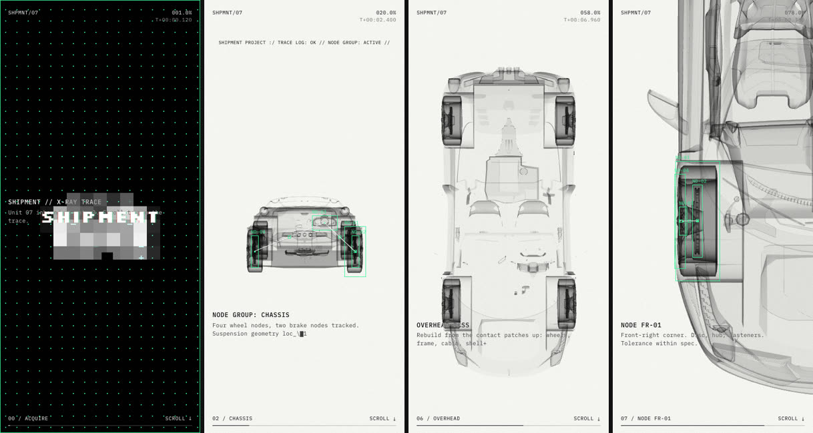

# X-ray scroll film

 

| path | what |
|---|---|
| `template/engine.js` | renderer, x-ray + glitch shaders, model normalising/splitting/staging, tracker HUD, scroll plumbing. Shared: change it here, then `scripts/sync-engine.sh` |
| `template/film.js` | the storyboard: one 100-unit GSAP timeline. Per film, edit freely |
| `template/index.html` | page + `window.XRAY` config + chapter captions + HUD words (EDIT markers) |
| `template/styles.css` | HUD, captions, loader. Shared like the engine |
| `examples/shipment/` | the reference film: Ferrari 458 (three.js example model, loaded from its repo) with a hand-mapped build order |
| `scripts/new-film.sh <dest> <model.glb>` | scaffold a film and print the model's node names |
| `scripts/glb-parts.mjs <model.glb>` | node tree with the names three.js will use (sanitised, de-duplicated) — what stage regexes match against |
| `scripts/shot.mjs <dir> <out.png> [p …]` | headless Chrome with the GPU: screenshots at timeline points (`?p=`), tiled into a contact sheet, page console printed. No npm deps (Node 22+, Chrome, ffmpeg) |
| `scripts/serve.mjs <dir> [port]` | static server (`file://` can't load modules or the GLB) |
| `references/config.md` | every `window.XRAY` field, and how staging/splitting/tracking resolve |
| `references/film.md` | state keys, timeline helpers, effect recipes, the reference storyboard beat by beat, and traps. Read before editing `film.js` |

## How the look is built

- **X-ray**: every mesh uses one additive shader (no depth test, double-sided) that writes *density* = `uDensity · (0.03 + 0.42·(1 − |N·V|)^2.6)` into a half-float target. Grazing surfaces add more, so rims go dark and middles stay see-through. The post pass maps density to film with Beer-Lambert, `1 − exp(−d·gain)`, over off-white paper. The floor reflection is the same scene drawn again with `root.scale.y = −1`, fading with depth.
- **Glitches** are uniforms on that one post shader (mosaic, dark, grid, red, scan, stat, smear, blur, jit), animated like anything else. Hard cuts are `set()` calls at a scroll position.
- **Assembly**: the model is normalised (front → −Z, on the floor, largest extent = `size`), split into parts, and each part is claimed by one of six stages — `lead base frame core shell skin`. A stage's reveal fades its parts in while they fly home from an offset (`FROM` in the engine, in model-size units).
- **HUD**: tracker boxes are each node's world AABB projected to screen, drawn on a 2D canvas, with white link lines and green midpoint ticks. They skip parts whose stage hasn't landed (reveal < 0.6). DOM text sits in one fixed layer with `mix-blend-mode: difference`, so it inverts over paper and black.
- **Scroll**: Lenis smooths the wheel; ScrollTrigger scrubs the timeline over `.track`, whose chapter `<section>`s are `--len × 13vh` tall in the same 100 units. Captions stick at 40vh and decode in when their chapter is under 45%.

## Workflow

1. **Collect** the model (GLB/glTF; convert OBJ/FBX first, e.g. with the comic-cover skill's `build-model.sh` or `npx gltf-transform`), the words (logo, header line, chapter captions), and any reference video. For a video, pull frames first (`ffmpeg -i v.mp4 -vf fps=6,scale=240:-1,tile=5x3 sheet_%02d.png`) and map its beats onto the chapters in `references/film.md`.
2. **Scaffold**: `~/.claude/skills/xray-scroll/scripts/new-film.sh <dest> <model.glb>`. It prints the node tree.
3. **Stage the build.** With named parts (cars, kitbashes, CAD exports), map node names to stages in `window.XRAY.stages` with anchored regexes. A matching group claims its whole subtree, so `^wheel_fl$` takes the tire, rim and disc with it. Single merged meshes (Meshy, scans) need nothing: `split: 'auto'` breaks them into islands or slices. Check the split with `PAGE='index.html?parts' node …/shot.mjs <dest> /tmp/p.png 38`; the console lists every part with its stage, centre and size.
4. **Set orientation** if the front isn't +Z (`model.forward`), and pick tracker nodes and the close-up `focus` (a small, dense, recognisable part: a wheel hub, a lens, a joint). Leave them out to auto-pick mid-sized parts.
5. **Contact sheet**: `node …/shot.mjs <dest> /tmp/s.png 1 8 20 30 38 49 58 71 78 95`, Read it, adjust (`density`, `gain`, stage map, `film.js` frames), repeat. Then `SIZE=390x844` for phones and `FPS=1` for frame rate.
6. **Write the captions** in `index.html` (keep the chapter `--len` values in sync with `film.js`, summing to 100) and **hand over**: `node …/scripts/serve.mjs <dest> 5173`. Mention `?p=NN` for jumping to a point.

## Rules

- Every mesh must use the engine's x-ray material. A stock three material ignores the density pipeline and renders garbage. New geometry (props, labels in 3D) goes through `xrayMaterial()`.
- Camera frames in `film.js` are in model units (`M.l`, `M.w`, `M.h`, `fs` = focus size). Don't hard-code world numbers or a second model won't fit. Overhead shots aim at the top plane (`ty: M.h`) or tall models balloon toward the camera.
- One property, one tween at a time: overlapping `to()`s on the same key fight while scrubbing. End one before the next starts.
- Fixed overlays are their own stacking context: blend on the `.overlay.blend` layer itself, never on its children. Keep z-index off `.track` and the canvases, or the captions stop inverting.
- Test with `?p=` screenshots, not by eye on a smooth-scroll page: Lenis + scrub lag makes any single frame ambiguous.

## Known limits

- Skinned meshes render in bind pose (the x-ray shader doesn't skin), and splitting skips them. Freeze a pose into a static mesh first if it matters.
- Needs WebGL2 half-float render targets with MSAA (all current desktop and mobile Chrome/Safari/Firefox). Frame rate is untested on low-end laptops: two scene passes + one full-screen post pass at ≤1.5× DPR.
- Auto staging is a heuristic (front 12% leads, the rest builds bottom-up in height bands). A real build order needs named parts and a stage map.
- Short glitches are tied to scroll position: a slow scroll lingers on NO SIGNAL, a fast flick skips it. That's the tradeoff of scrubbing everything.
